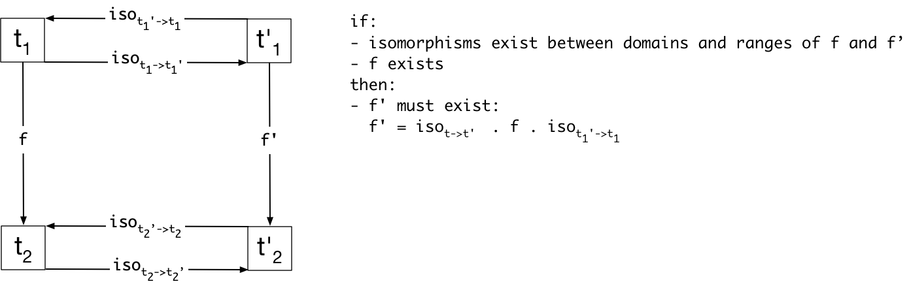

# Basic Sequence Language Theory
Aetherling is a system for compiling data flow pipelines to efficient implementations in hardware accelerators.
Aetherling uses category theory and dependent types to ensure all expressible programs compile to efficient hardware.

This document's version of Aetherling has the most simple types and operators necessary to get multi-rate pipelines. 
Section [Multi-Rate Pipelines](#multi-rate-pipelines) explains why these pipelines are the simplest demonstration of the advantages of Aetherling's approach.

# Sequence Language
Programmers use Aetherling by writing code in the sequence language.
The sequence language is a combinator language for data flow programs with standard functional programming operators. 
Programs in the language are **unscheduled**: it is unspecified whether operations are parallel or sequential. 
There is no clear interpretation of unscheduled programs as hardware accelerators.

## Atom Types
The sequence language has two parts. The first part of the sequence language is the atoms. 
Atoms are standard programming primitives, such as integers. 
Atoms also include the minimal derived types necessary to express arithmetic and boolean operators on the primitives. 

1. `Int` - integer
2. `t x t'` - heterogeneous tuple
4. `t -> t'` - function

## Atom Operators
1. `Id :: t -> t`
1. `Const :: t -> t`
1. `Const_Gen :: t -> () -> t`
1. `Add :: (Int x Int) -> Int`
1. `Fst :: (t x t') -> t`
1. `Snd :: (t x t') -> t'`
5. `Zip :: t1 -> t2 -> t1 x t2`

## Sequence Types
The second part of the language lifts the atomic values and functions onto fixed-length collections.

1. `Seq n t` - homogeneous, fixed-length sequence

`Seq` is a functor. It is a fixed length version of the `[]` list functor in Haskell. 
`Seq n t` lifts a type `t` onto a sequence of `n` elements of type `t`. 
The `Map` operator in the below operator section is `Seq`'s `fmap`. 
`Map` lifts functions from `t -> t'` to `Seq n t -> Seq n t'`. 

We do not allow sequences of functions, such as `Seq n (Int -> Int)`.

**Pat** - Is this enough of a callout to the fact that `Seq` is a functor? I really dislike making it its own section. Making a whole section about `Seq` due to it being a functor overplays its differences from the other types. Both `t x t'` and `t -> t'` are also functors when one type is applied.

## Sequence Operators
1. `Map n :: (t -> t') -> Seq n t -> Seq n t'`
1. `Map2 n :: (t -> t' -> t'') -> Seq n t -> Seq n t' -> Seq n t''`
3. `Up_1d n :: Seq 1 t -> Seq n t`
4. `Down_1d n :: Seq n t -> Seq 1 t`
7. `Partition no ni :: Seq (no*ni) t -> Seq no (Seq ni t)`
7. `Unpartition no ni :: Seq no (Seq ni t) -> Seq (no*ni) t`

Note: Seq is also an applicative functor. Aetherling's `Map2` is equivalent to Haskell's `liftA2` for applicative functors.

## Sequence Isomorphisms
`Partition no ni` and `Unpartition no ni` form an isomorphism between the types `Seq (no*ni) t` and `Seq no (Seq ni t)` for all choices of `no` and `ni`. 
Both types are objects in the category of types. 
`Partition` and `Unpartition` convert between the types in a way that preserves the identity function. 
```
Unpartition no ni . Partition no ni == Id
```

The following commutativity diagram shows the relationship between functions on isomorphic types. 



Specializing this diagram for `Seq` proves:
1. For any function `f :: Seq (no*ni) t -> Seq (no*ni) t` there is a function `f' :: Seq no (Seq ni t) -> Seq no (Seq ni t')`. 
1. The inputs and outputs of `f` and `f'`  are equivalent up to isomorphism. 

We can repeatedly apply this isomorphism to convert between a flat `Seq` and any arbitrarily nested `Seq`

We will use these isomorphisms to produce Aetherling's rewrite rules that:
1. lower from the sequence language into the space-time IR.
1. schedule programs in the space-time IR.

# Space-Time IR
Aetherling lowers the sequence language to a space-time IR. 
Programs in the IR are **scheduled**: the parallelism of each operators is specified. 
An operator can be parallel (scheduled in space) or sequential (scheduled in time).
The space-time IR uses these schedules to interpret the data flow programs as hardware accelerators. 

In hardware accelerators, all operators are implemented using separate hardware components that run in parallel. 
If two functions are composed in the sequence language (such as `g . f`), they form a pipeline.
`f`'s hardware component emits output that is consumed as input by `g`'s component'.
All composed operators in a pipeline must process data over the same amount of time, which we count in clock cycles. 
This requirement is known as **time matching**

In addition to a time property, operators and pipelines also have input throughputs and output throughputs.
A **throughput** (or **rate**) is the average number of atoms accepted or emitted per clock.
In a pipeline, the output throughput of each producer function must equal the input throughput of its consumer function.
In `g . f`, `f`'s output throughput must equal `g`'s input throughput.
This requirement is known as **producer-consumer rate matching**. 

The first benefit of rate matching is that, together with time matching, it ensures all components in a pipeline operate on the same amount of data over the same clock cycles.

The second benefit of producer-consumer rate matching is that all pipelines compile to efficient hardware accelerators. 
Hardware accelerators are efficient if they use minimal compute and storage resources. 
Matching rates minimizes these resources. 
1. **Compute** - matching rates ensures all nodes run at the exact rate required by their upstream producers and downstream consumers. 
Thus, all operators are implemented using the minimal parallelism necessary to achieve the target throughput. 
1. **Storage** - matching rates ensure that nodes can perform streaming computation. 
As soon as a producer emits data, the consumer can start operating on the entire output without buffering. 
If the producer had a higher throughput, a buffer would be required to store part of the producer's output while the consumer handled a separate piece of it.
If the producer had a lower throughput, a buffer would be required to collect multiple of the producer's outputs into a single input for the consumer. 
No buffering between operators means minimal storage resources. 

## Single-Rate Pipelines
We first focus on **single-rate pipelines**, those in which all operators have the same input and output throughputs. 
These pipelines always satisfy the producer-consumer rate-matching requirement.

### Space-Time Types
Aetherling expresses schedules using the type system.
Operators' input and output sequences are scheduled as space-sequences (`SSeq`) and time-sequences (`TSeq`). 
`SSeq`s and `TSeq`s define the number of clock cycles over which an operator accepts output or emits input. 
They also define the atom data type accepted or emitted by the operator. 

A period for a `SSeq n t` or `TSeq n t` is the number of clock cycles required for an operator to accept or emit one `t`.
If `t` is an atomic type, then the period is 1.
`SSeq` and `TSeq` are defined in terms of periods rather than clock cycles in order to support nested sequence types.

1. `SSeq n t` - homogeneous, fixed-length sequence in space. This sequence is parallel.
    1. An operator that produces a `SSeq` emits `n` values of type `t` over one period. 
3. `TSeq n v t` - homogeneous, fixed-length sequence in time. This sequence is sequential.
    1. `n` is number of utilized periods. `v` is number of empty periods. We will explain the `v` parameter more in the [multi-rate pipelines section](#multi-rate-pipelines).
    1. An operator that produces a `TSeq` emits `n` values of type `t` over `(n+v)` periods.
     
#### Period Example
We demonstrate the need for the term period first by showing two examples where a period is the same as a clock, and then showing a nested example where the two are different.

An operator `SSeq 5 Int -> SSeq 5 Int` accepts and emits 5 ints each clock. An `SSeq` takes one period. Since `Int` is an atomic type, a period is one clock.

An operator `TSeq 5 1 Int -> TSeq 1 5 Int` accepts ints on five of six periods. It accepts nothing on the sixth period. Note that these periods can be in any order. A period is one clock because `Int` is an atomic type.

An operator `TSeq 5 1 (TSeq 3 0 Int) -> TSeq 2 4 (TSeq 2 1 Int)` accepts `TSeq 3 0 Int` on five of six periods. A period is three clocks as each `TSeq 3 0 Int` requires three clocks.

### Sequence To Space-Time Isomorphisms
`Seq n t` is isomorphic to `SSeq n t` and `TSeq n t` by construction. 
They are all ordered sequences of the same length. 

Since they are isomorphic, any `f :: Seq n t -> Seq m t'` function must have contextual equivalent versions `f_t :: TSeq n v t -> TSeq m u t'` and `f_s :: SSeq n t -> SSeq m t'`.
This is proven in the same way as shown in [the `Seq` isomorphism section.](#sequence-isomorphisms)

We will use these isomorphisms to produce the rewrite rules that convert programs from the sequence language to the space-time.

### Operators
1. `Map_s n f :: (t -> t') -> SSeq n t -> SSeq n t'`
2. `Map_t n f :: (t -> t') -> TSeq n v t -> TSeq n v t'`

## Operator Properties
In order to guarantee time and throughput matching, we must model the time, parallelism, and throughput of operators.
We also model the resources of operators to prove that our schedules produce efficient hardware accelerators. (We use the terms area and resources interchangeably.)

### Time
`type_time(t)` is the number of clock cycles needed for an operator to accept or emit one `t`.
`type_time` formalizes the [above definitions](#space-time-types) of `TSeq` and `SSeq`.

1. `type_time(Int) = 1`
1. `type_time(t x t') = 1`
1. `type_time(SSeq n t) = n * type_time(t)`
1. `type_time(TSeq n v t) = (n+v) * type_time(t)`

`time(f :: t -> t') = type_time(t)` provides the syntax for applying `type_time` to an operator.

**Axiom** - `type_time(t) == type_time(t')` forall operators `f :: t -> t'`

### Parallelism
`type_parallelism` is the number of atoms accepted or emitted by an operator on each utilized clock cycle. 

1. `type_parallelism(Int) = 1`
1. `type_parallelism(t x t') = 1`
1. `type_parallelism(SSeq n t) = n * type_time(t)`
1. `type_parallelism(TSeq n v t) = type_time(t)`

`input_parallelism(f)` and `output_parallelism(f)` provide the syntax for applying `type_parallelism` to an operator.

1. `input_parallelism(f :: t -> t') = type_parallelism(t)`
1. `output_parallelism(f :: t -> t') = type_parallelism(t')`

### Throughput
An operator's throughput is the number of atoms produced or consumed per clock.

1. `input_throughput(f) = input_parallelism(f) / time(f)`
1. `output_throughput(f) = output_parallelism(f) / time(f)`

### Type Atoms
`type_atom` is the atom type used in a potentially nested `TSeq` or `SSeq`.

1. `type_atom(Int) = Int`
1. `type_atom(t x t') = t x t'`
1. `type_atom(SSeq n t) = type_atom(t)`
1. `type_atom(TSeq n t) = type_atom(t)`

`input_atom(f)` and `output_atom(f)` provide the syntax for applying `type_atom` to an operator.

1. `input_atom(f :: t -> t') = type_atom(t)`
1. `output_atom(f :: t -> t') = type_atom(t')`

### Area
`area(f)` is the amount of area on the hardware accelerator required for a space-time operator `f`.
We model resource requirements as three types of area:

1. **Compute Area** is relative to a one-bit adder. 
For example, `Add` for an eight bit integer has eight compute units of area as it is roughly equivalent to eight one bit adders.
1. **Storage Area** is relative to a one-bit register. 
1. **Wire Area** is relative to one-bit wire connecting two components. 
The wiring is for connecting composed operators.
To avoid double counting wiring area, we only consider an operator's output wires.

We represent area as the vector `{compute_area, storage_area, wire_area}`. 
The area vector supports `+`, `*` by a scalar, and `*` by a scalar.
`num_bits` returns the number of bits in an `Int` or tuple type.

1. `area(Map_s n f) = n * area(f)`
2. `area(Map_t n f) = area(f)`
1. `area(Id) = {0, 0, 0}`
1. `area(Const_Gen n) = {0, num_bits(Int), num_bits(Int)}`
1. `area(Add) = {num_bits(Int), 0, num_bits(Int)}`
5. `Zip`, `Fst`, `Snd`, and `Add_Unit` don't have area. They are just used for connecting other operators.

## Multi-Rate Pipelines
A **multi-rate pipeline** is a pipeline of operators in which all input and output throughputs are not equal. 

### Types
Multi-rate modules are expressed in the type system using the `v` parameter of `TSeq n v t`. 
As a reminder:
- `n` is number of utilized periods.
- `v` is number of empty periods. 
- A `TSeq` materializes `n` values of type `t` over `(n+v) * periods to process one t` periods.

An empty period is one in which the sequence does not process new data. `v` enables Aetherling to (1) match input and output time lengths and (2) express schedules with underutilization 
1. An operator's input and output `TSeq`s must take the same amount of time. Empty clocks can equalize time lengths for `TSeq`s with different `n` parameters. 
    1. For example, `Up_1d_t` takes in one input on one clock cycle and then repeatedly outputs it for multiple clock cycles. 
    While the output is busy emitting data, the input cannot accept the next value. 
    The empty periods indicate this waiting so that the input and output `TSeq`s take the same amount of time.
1. Underutilized hardware is hardware that is unused on some clock cycles.
An operator with input and output `TSeq`s that have non-zero `v`s may be unused during those periods.
    1. If `Map_t 1 Add` had any empty clocks, it would be underutilized. 
    This is unlike `Up_1d_t`. 
    It is operator specific whether empty clocks mean underutilization or waiting while processing occurs.
    1. Underutilization is necessary to compose operators in multi-rate pipelines. 
    Consider `Up_1d_t 4 . Map_t 1 Add`.
    `Map_t` must emit an output every fourth clock so that its output throughput matches `Up_1d_t`'s input throughput.
    To accomplish this rate matching, `Map_t** must be underutilized.
    
### Operators
1. `Up_1d_s n :: SSeq 1 t -> SSeq n t`
3. `Up_1d_t n :: TSeq 1 (n+v-1) t -> TSeq n v t`
4. `Down_1d_s n :: SSeq n t -> SSeq 1 t`
4. `Down_1d_t n :: TSeq n v t -> TSeq 1 (n+v-1) t`
5. `Partition_ts no ni :: TSeq 1 (no + v - 1) (SSeq (no*ni) t) -> TSeq no v (SSeq ni t)`
5. `Unpartition_ts no ni :: TSeq no v (SSeq ni t) -> TSeq 1 (no + v - 1) (SSeq (no*ni) t)`
5. `Partition_ss no ni :: SSeq (no*ni) t -> SSeq no (SSeq ni t)`
5. `Unpartition_ss no ni :: SSeq no (SSeq ni t) -> SSeq 1 (SSeq (no*ni) t)`


### Throughput
1. `Up_1d_s`
    1. `input_throughput(Up_1d_s n) = 1 t per 1 clocks`
    1. `output_throughput(Up_1d_s n) = n t per 1 clocks`
3. `Up_1d_t`
    1. `input_throughput(Up_1d_t n) = 1 t per (n+v) clocks`
    1. `output_throughput(Up_1d_t n) = n t per (n+v) clocks`
4. `Down_1d_s`
    1. `input_throughput(Down_1d_s n) = n t per 1 clocks`
    1. `output_throughput(Down_1d_s n) = 1 t per 1 clocks`
4. `Down_1d_t`
    1. `input_throughput(Down_1d_t n) = n t per (n+v) clocks`
    1. `output_throughput(Down_1d_t n) = 1 t per (n+v) clocks`
5. `Partition_ts`
    1. `input_throughput(Partition_ts no ni) = (no*ni) t per (no+v) clocks`
    1. `output_throughput(Partition_ts no ni) = (no*ni) t per (no+v) clocks`
5. `Unpartition_ts`
    1. `input_throughput(Unpartition_ts n ni) = (no*ni) t per (no+v) clocks`
    1. `output_throughput(Unpartition_ts n ni) = (no*ni) t per (no+v) clocks`
5. `Partition_ss`
    1. `input_throughput(Partition_ss no ni) = (no*ni) t per 1 clocks`
    1. `output_throughput(Partition_ss no ni) = (no*ni) t per 1 clocks`
5. `Unpartition_ss`
    1. `input_throughput(Unpartition_ss no ni) = (no*ni) t per 1 clocks`
    1. `output_throughput(Unpartition_ss no ni) = (no*ni) t per 1 clocks`

### Area
1. `area(Up_1d_s n) = {0, 0, n * num_bits(t)}`
1. `area(Up_1d_t n) = {0, num_bits(t), num_bits(t)} + area(counter)`
1. `area(Down_1d_s n) = {0, 0, num_bits(t)}`
1. `area(Down_1d_t n) = {0, num_bits(t), num_bits(t)} + area(counter)`
1. `area(Partition_ts no ni) = {0, ((no-1) * ni) * num_bits(t), ni * num_bits(t)} + area(counter)`
1. `area(Unpartition_ts no ni) = {0, ((no-1) * ni) * num_bits(t), (no * ni) * num_bits(t)} + area(counter)`
1. `area(Partition_ss no ni) = {0, 0, 0}`
1. `area(Unpartition_ss no ni) = {0, 0, 0}`

Many of the sequential operators require a counter to track clock cycles.
1. `area(counter) = {num_bits(Int), num_bits(Int), num_bits(Int)}`

## Rewrite Rules
### Map
1. Sequence To Space - `Map n f -> Map_t 1 (Map_s n f)`
    1. `Map n f :: Seq n t -> Seq n t'`
    1. `Map_t 1 (Map_s n f) :: TSeq 1 0 (SSeq n t) -> TSeq 1 0 (SSeq n t')'`
1. Slowdown - `Map_t 1 (Map_s (no*ni) f) -> Unpartition_ts no ni . Map_t no (Map_s ni f) . Partition_ts no ni`
    1. `Map_t 1 (Map_s (no*ni) f) :: TSeq 1 _ (SSeq (no*ni) t) -> TSeq 1 _ (SSeq (no*ni) t)'`
    1. `Map_t no (Map_s ni f) :: TSeq no v (SSeq ni t) -> TSeq no v (SSeq ni t')`
    1. `Unpartition_ts no ni . Map_t no (Map_s ni f) . Partition_ts no ni :: TSeq 1 _ (SSeq (no*ni) t) -> TSeq 1 _ (SSeq (no*ni) t)'`
    
Note: I dropped the underutilization computation from `TSeq` where it became onerous.

### Upsample
1. Sequence To Space - `Up_1d n -> Map_t 1 (Up_1d_s n)`
    1. `Up_1d n :: Seq 1 t -> Seq n t`
    1. `Map_t 1 (Up_1d_s n) :: TSeq 1 0 (SSeq 1 t) -> TSeq 1 0 (SSeq n t)`
1. Slowdown - `Map_t 1 (Up_1d_s (no*ni)) -> Unpartition_ts no ni . Map_t no (Up_1d_s ni) . Up_1d_t no . Partition_ts 1 1`
    1. `Map_t 1 (Up_1d_s (no*ni)) :: TSeq 1 _ (SSeq 1 t) -> TSeq 1 _ (SSeq (no*ni) t)`
    1. `Map_t no (Up_1d_s ni) :: TSeq no (SSeq 1 t) -> TSeq no (SSeq ni t)`
    1. `Up_1d_t no :: (TSeq 1 (SSeq 1 t)) -> (TSeq no (SSeq 1 t))`
    1. `Unpartition_ts no ni . Map_t no (Up_1d_s ni) . Up_1d_t no . Partition_ts 1 1 :: TSeq 1 _ (SSeq 1 t) -> TSeq 1 _ (SSeq (no*ni) t)`

### Downsample
1. Sequence To Space - `Down_1d n -> Map_t 1 (Down_1d_s n)`
    1. `Down_1d n :: Seq n t -> Seq 1 t`
    1. `Map_t 1 (Down_1d_s n) :: TSeq 1 0 (SSeq n t) -> TSeq 1 0 (SSeq 1 t)`
1. Slowdown - `Map_t 1 (Down_1d_s (no*ni)) -> Unpartition_ts 1 1 . (Map_t 1 (Down_1d_s ni)) . Down_1d_t no . Partition_ts no ni`
    1. `Map_t 1 (Down_1d_s (no*ni)) :: TSeq 1 _ (SSeq (no*ni) t) -> TSeq 1 _ (SSeq 1 t)`
    1. `Map_t 1 (Down_1d_s ni) :: TSeq 1 (SSeq ni t) -> TSeq 1 (SSeq 1 t)`
    1. `Down_1d_t no :: (TSeq no (SSeq ni t)) -> (TSeq 1 (SSeq ni t))`
    1. `Unpartition_ts 1 1 . (Map_t 1 (Down_1d_s ni)) . Down_1d_t no . Partition_ts no ni :: TSeq 1 _ (SSeq (no*ni) t) -> TSeq 1 _ (SSeq 1 t)`

### Unpartition_ts/Partition_ts Removal
1. `Partition_ts no ni . Unpartition_ts no ni = Id`
**Danger: `Partition_ts . Unpartition_ts` is not really Id in Space-Time. There will be underutilized clocks here. The partition_tsing and unpartition_tsing takes n clocks. However, the interface to both of these functions is just an `SSeq`. The `SSeq` doesn't account for time.**
2. `Unpartition_ts no ni . Partition_ts no ni = Id`
