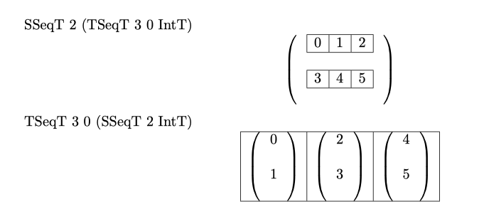
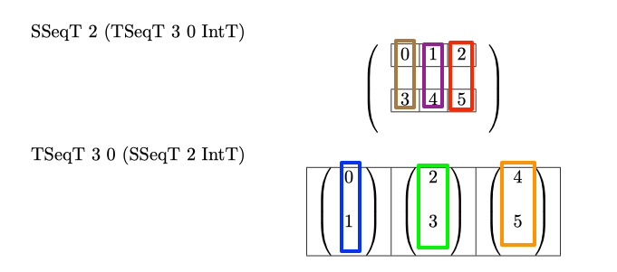
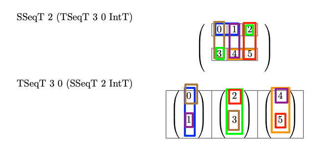

# Lemmas About Structure of Aetherling Programs
## Diamond Input Type Relation
**Lemma - for any diamond in the space-time IR, time(t1') == time(t1), length(t1) == length(t1'), and throughput(t1) == throuhgput(t1')**


What restrictions do I have:
1.	`TSeq/SSeq` components of t2 and t3 must be the same – 
    1. The only binary operations in the space-time IR on sequences are `Map2_s` and `Map2_t`.
    1. The type signatures of these operators are `Map2_s n :: (a -> b -> c) -> SSeq n a -> SSeq n b -> SSeq n c` and `Map2_t n i :: (a -> b -> c) -> TSeq n i a -> TSeq n i b -> TSeq n i c`
    1. This type signatures enforce this condition.
1.	`Seq` components of t1 and t1’ must be the same – 
    1. The only binary operation in the sequence language on sequences is `Map2` 
    1. The type signature is `Map2 n :: (a -> b -> c) -> Seq n a -> Seq n b -> Seq n c` 

This means: 
1.	t1’ time must be same as t3 time - can’t have a producer with different time than a consumer
2.	t2 time must be same as t3 time – the definitions of `Map2_s` and `Map2_t` ensure their `TSeq` and `SSeq` components are the same. Therefore, their times must be the same.
3.	t1 time must be same as t2 time – same reason as t1’ and t3 time
4.	Thus t1’ time must be same as t1 time
5.	t1 length must equal t1’ length by `Map2` property
6.	Thus, `throughput(t1) == length(t1) / time(t1) == length(t1') / time(t1') == throughput(t1')` 

## Diamond Without `Partition/Unpartition/Seq_To_Tuple/Tuple_To_Seq` Lemma
**Lemma - if i have a pipeline without `Partition`, `Unpartition`, `Seq_To_Tuple`, and `Tuple_To_Seq`, then I can lower the pipeline's output type to space-time IR, push that type back through the pipeline, and if I encounter any diamonds, the input types to both branches of the diamonds will be the same.**


1. As shown in the [diamond input type relation lemma](#diamond-input-type-relation), the `TSeq/SSeq` components of t2 and t3 must be the same.
1. All other operators process one or zero layers of `Seq`. 
1. Therefore, rewriting all other operators based on output types must apply the slowdown to the same nesting
1. Since the nesting of slowdown doesn't change and `t1` and `t1'` have the same seq structure and lengths, they must become the same types in the space-time IR.

## Partition Moving
**Lemma - for any structure-preserving operator f, I can find a semantics preserving rewrite such that `f >>> Partition no ni t === Partition no ni t >>> f'` and `Unpartition no ni t >>> f === f >>> Unpartition no ni t`**

1. All my structure preserving operations support a rewrite rule `f === Partition no ni t >>> g >>> Unpartition no ni t`
1. Therefore, any structure preserving operation, I can do:
    1. `f >>> Partition no ni t === Partition no ni t >>> g >>> Unpartition no ni t >>> Partition no ni === Partition no ni t >>> g`
    1. `Unpartition no ni t >>> f === Unpartition no ni t >>> Partition no ni t >>> g >>> Unpartition no ni t >>> Partition no ni === g >>> Unpartition no ni t`
1. This can be extended to a DAG by repeating the nesting rewrite rule and `Partition`/`Unpartition` cancelling for each branch of the DAG.

## Minimum Underutilization Computation
**Given a DAG such as the one below, find the minimum necessary underutiliziation for a fully sequential operator.**


Approach: 
1. Treat each path of the DAG independently by searching the DAG as if it was a tree.
1. Walk each path in the tree, find the minimum necessary underutilization, propagate that back to output
1. When merging two paths in the DAG, take the larger of the underutilizations
1. Issue - partition - if partitioning, underutilization may be divided between two layers. This is addressed by tracking how much utilization is required at each layer or divdied between multiple layers.


1. For a program with a graph structure `G={N,E}`, start with the output edge.
    1. Let the edge's output type have form `[n_0/d_0, ..., n_i/d_i]`.
    1. Initialize the per layer underutilization data structure as a list of length i of `0`.
    1. Initialize the shared underutilization between layers data structure as an empty list.
1. For the current node at depth i:
     1. If higher-order: 
          1. If `Reduce n`: increment the underutilization data structure with index i by `n-1`
          1. For all higher order nodes: recur on the output edge of the sub-graph with depth (i+1)
      1. If `Partition`:
          1. Replace element i of the per layer underutilization data structure two elements, both 0's, and add a triple to the shared underutilziation data structure of `{i, i+1, u}`, where `u` was the value stored in location i of the per layer underutilization data structure
      1. If `Unpartition`
          1. Replace element i and i+1 of the per layer underutilization data structure with one element:
              1. `max(u, (no+ni)**per_layer[i]*per_layer[i+1])` if `{i, i+1, u}` exists
                  1. This needs to actually use the partition invalid formula
              1. `per_layer[i]*per_layer[i+1]` otherwise
          1. For any shared underutilization data structures with `i+1`, replace that with `i`
      1. If `Seq_to_Tuple`:
          1. Replace element i and i+1 of the per layer underutilization data structure with one element:
              1. `max(u, per_layer[i]*per_layer[i+1])` if `{i, i+1, u}` exists
              1. `per_layer[i]*per_layer[i+1]` otherwise


### Structure Changing Operations Issue
The issue with structure changing operations is that underutilization is assigned per layer of the nesting.
However, when a layer is split, it is unclear how to split undertuilization.
The following examples show this:

```
Select_1d 4 0 (Seq 4 Int) >>> Unpartition 1 4 Int
Map 1 (Select_1d 4 0 Int) >>> Unpartition 1 1 Int
Select 4 0 (Seq 4 Int) >>> Map 1 (Select_1d 4 0 Int) >>> Unpartition 1 1 Int
```

#### `Partition` and `Unpartition`

# Lemmas About Slowing Down Types
Structure of problem:
1. Have a set of `Seq`'s is: `Seq n i_max`
1. Each represents one `Seq` in the output type of an aetherling program
1. Can convert each of the `Seq`'s into either:
    1. `SSeq n`
    1. `Tseq n i` s.t. `i == i_max`
    1. `TSeq no io (SSeq ni)` s.t. `no*ni == n` and `io <= i_max`
1. Have a periods property defined in [basic document](Basic.md#space-time-types)
1. Need the product of the periods of the resulting `TSeq` and `SSeq` to equal slowdown factor `s`.

## Why `TSeq n i` must have `i == i_max`
Assume that `i` could be less than `i_max`.
I will show that this will produce a rewrite for an expression that cannot be solved.
The example program is `Down_1d 4 0 :: Seq 4 Int -> Seq 1 Int`.

`i_max` for this program's output is `3` since the highest throughput of the minimum area programs: `Down_1d_t 4 0 0 :: TSeq 4 0 Int -> TSeq 1 3 Int`.

If I rewrote the output type to `TSeq 1 1 Int`, I could not use the `Down_1d` rewrite rules to produce this type. The two options are
1. Fully Sequential - `Down_1d_t 4 0 0 :: TSeq 4 0 Int -> TSeq 1 3 Int`
1. Partially Parallel - `Map_t 1 (Down_1d_s 2 0 Int) . Down_1d_t 2 0 (Seq 2 Int) :: TSeq 2 0 (SSeq 2 Int) -> TSeq 1 1 (SSeq 1 Int)`

Therefore, if I produce an output type that is partially parallel, it must be `TSeq no io (SSeq ni)`.

## What Are The Options For Applying A Slowdown By A Prime
I will look at primes as they they are the smallest subproblem.
They can't be split into subfactors. 
Therefore, in order to slowdown by a prime, it must be applied entirely to one `Seq`.
I will first start by converting the `Seq n` to a `SSeq n` and then trying to slowdown the `SSeq n`.
The ways to apply a prime slowdown `s_p` to `SSeq n` with `i_max` are:
1. If `(n+i_max) == s_p`, then `TSeq n i_max`
1. If `n % s_p == 0`, then `TSeq s_p 0 (SSeq (n / s_p))`
1. If `(n+i_max) >= s_p == 0`, then need to slowdown so that takes `s_p` clocks. There are multiple possible choices for the resulting `TSeq no io (SSeq ni)`. To find the best answer (least underutilization):
    1. `no * ni == n`
    1. `no + io == s_p`
    1. `io <= i_max`
    1. min `io` as want minimum underutilization
    1. Solution
        1. `no = n / ni`
        1. `(n/ni) + io == s_p`
            1. solve this by - trying all the divisors of n from smallest to largest. 
            1. take smallest `ni` such that `io` is non-negative integer less than or equal to `i_max` and `no` is a positive integer
            1. this will give least underutilization and area for the given throughput
        1. `n + ni * io == ni * s_p`
        1. `n == ni * s_p - ni * io`
        1. `ni * s_p - ni * io == n`
        1. `0*ni^2 - ni * io + 0 * io^2 + s_p * ni + 0 * io - n == 0`
        1. `ni * (s_p - io) == n`
        1. `ni * (-1 * io + s_p) == n`
        1. If the above equation is solved

## What Are The Options For Applying A Slowdown By A Non-Prime
### Greedy Algorithm For Sets of Primes
I propose a greedy algorithm that tries to apply a slowdown `s` to a sequence type `t = SSeq n_0 (SSeq n_1 (...))`. I refer to each `Seq`  as a layer of the type.
1. Let `{s_i}` be the set of prime factors of `s`. Let `r` be an initially empty set.
1. For each `s_j` in `{s_i}`:
    1. Try to slowdown the `SSeq n` or `TSeq no 0 (SSeq ni)` from outer to inner layers without underutilization by only trying options 1 and 2 above.
        1. How to slowdown a `TSeq no io (SSeq ni)` - 
            1. Let `t` be the amount that `SSeq n` is faster than `TSeq no io (SSeq ni)`down
            1. If can slowdown `SSeq n` using by `r*t` with options 2 or 3 above described for primes, return that. Otherwise, return `TSeq no io (SSeq ni)` and don't try to slow down this layer.
        1. Don't need to worry about slowing down a `TSeq n i` as it is already slowed down as much as possible.
    1. If not able to find a layer to apply the slowdown, add `s_j` to `r`
1. For each `r_j` in `r`
    1. Try to slowdown the `SSeq n` or `TSeq no io (SSeq ni)` from outer to inner layers with option 3.

### Will Greedy Approach Fail To Find Solutions?
Greedy approach will first try to slowdown using a set of factors `{s_i}` of slowdown `s` across `Seq`'s using just `no` and `ni` without `io`.
Greedy approach would miss potential solutions that use all factors in `{s_i}` if using a factor `s_j` from `{s_i}` for slowing down one layer means that later I cannot use the remaining factors of `{s_i}` to slow down another layer.
This won't be an issue because:
1. If I could slowdown `Seq n` and `i_max` with factors `{s_i}`, that means either:
    1. `n` is divisible by s - `n`'s factors `{f_i}` are a superset of the factors in `{s_i}`.
    1. `n+i_max` is greater than s - `n+i_max`'s factors `{f_i}` are a superset of the factors in `{s_i}`.
1. The greedy algorithm could miss this solution by due to having removed one or more factors from `{s_i}` by using them for slowing down other layers. The greedy algorithm will instead try to slowdown `Seq n` and `i_max` with a subset `sub` of `{s_i}`. 
1. Since `sub` is a subset of `{s_i}` and `{s_i}` is a subset of `{f_i}`, then `sub` is a subset of `{f_i}`
1. Therefore, the greedy algorithm won't miss solutions. If a set of factors divides into `n` or is greater than `n+i_max`, the subset of factors used by the greedy approach will also satisfy those conditions.

## Why Is My Approach Failing To Maintain Same Number of Valids Per Active Clock?
For the below example, input is 3 int's per clock but the output is 2 ints per clock
```
ReshapeN TSeqT 8 0 (SSeqT 3 (TSeqT 40 40 (SSeqT 1 IntT))) TSeqT 480 160 (SSeqT 2 IntT) n556
```

The issue is that I'm adding in extra factors from Seq that you can't actually slow down by.

### Can't Apply Primve Factors Individually
Applying prime factors (like my current approach) leads to partially parallel types that are invalid as they have parallel components that will be made temporal by later factors but not going to partially apply 

# Reshape
The central question for reshape is: given an input type and an output type of the same average throughput but potentially different number of pixels per active clock, what is the minimal amount of banking necessary to convert between the two access patterns?

1. Simple lower bound on amount of banking - the greater of the two input sequences' number of pixels per active clock cycle.
1. Can I generalize the lower approach 
    1. Unique Coordinates Lemma generalizations - 
        1. if same for N-1 of the axes, then two values must be different for the Nth axes. 
        1. if same for N-i axes, then at least one of i other axes must be different


Reshape type siganture:

```
Reshape :: T/SSeq ni_0 (T/SSeq ni_1 (...)) -> T/SSeq no_0 (T/SSeq no_1 (...))
```

The input and output types must have the same throughput. 

There are three components to a reshape.  
I will provide the components and the implementation.
1. Split `TSeq` or `SSeq` 
    1. `SSeq (no*ni) t -> SSeq no (Seq ni t)` - this is implemented with `Partition_s`
    1. `SSeq (no*ni) _ t -> SSeq no io (Seq ni ii t)` - this is implemented with `Partition_t`
1. Merge `TSeq` or `SSeq` 
    1. `SSeq no (Seq ni t) -> SSeq (no*ni) t` - this is implemented with `Unpartition_s`
    1. `TSeq no io (Seq ni ii t) -> TSeq (no*ni) _ t` - this is implemented with `Unpartition_t`
1. Flip 
    1. `TSeq no io (TSeq ni ii) -> TSeq ni ii (TSeq no io)` - this is just a buffer that retimes with throughput 1.
    1. `SSeq no (SSeq ni ii) -> SSeq ni (SSeq no)` - this does nothing.
    1. `TSeq no io (SSeq ni) -> SSeq ni (TSeq no io)` - see below, this is the `flip` that I must handle
    1. `SSeq ni (TSeq no io) -> TSeq no io (SSeq ni)` - see below, this is the `flip` that I must handle

The rest of this section will discuss how to implement the `flip` that exchange `SSeq` and `TSeq`.

## Input and Output Throughput
The memory implementing the `flip` must have input and output throughputs equal to the desired throuhgput.
You cannot use delay to hide latency.
Otherwise, on a clock cycle, you will get more data than you can store for that clock. 
Since there is no where to put the data, it will be dropped and lost.

## Memory Port Conflicts
I need to use banked memory in order to get the desired memory throughput.
I need to bank as I can't read multiple values from a single read ported memory on one clock cycle.
This is known as a port conflict.
I don't have access in magma to memories with more than one read port.

Even with banking, I still need to address port conflicts. 
For example, when flipping between the following types:



I will have port conflicts if I try to read or write any values to the same bank on the same clock.
The below image shows these conflicts separately for each type. 
Values in the same colored rectangle must be stored in different banks as they are on the same clock:

 

The below image is an extension of the above one.
The below image shows, for each type, the values that must be written to different banks in order to avoid any port conflicts.
A colored rectangle indicates that the contained values will occur on the same clock in one of the two types.
The rectangle colors are the same groups of values in both images.



### Memory Port Conflict Rules
I now formalize rules for telling if two values must be written to different bbanks.
For the below rules, let `flat_idx` be the index of a value when flattening `TSeq` and `SSeq` into a single `Seq`. 
I will only be using indexes in the flattened `Seq` for the below rules.
The rules for values that cannot be written to the same bank are:
1. Values that are on the same clock for TSeq (SSeq) will conflict. These are
values in the same contiguous block of length `sseq_dim` - `flat_idx, flat_idx+1, ..., flat_idx+(sseq_dim -1)` 
s.t. `flat_idx % sseq_dim == 0`
1. Values that are on the same clock for SSeq (TSeq) will conflict. These are values 
that have the same remainder when divided by `tseq_dim` - `flat_idx, flat_idx+tseq_dim,
flat_idx+2*tseq_dim, ..., flat_idx+(sseq_dim - 1)*tseq_dim`

## Converting Between SSeq (TSeq) and TSeq (SSeq) Indexes
In order to convert the above rules to non-flattened indexes, I need to convert between flattened and non-flattened indexes.
Let `s` be a value's index in the `SSeq`. 
Let `t` be a value's index in the `TSeq`. 
Converting between `(s,t)` coordinates and `flat_idx` by dividing or moduloing
the `flat_idx` by the inner dimension size.

### TSeq (SSeq) Coordinates
1. TSeq (SSeq) `s` = `flat_idx % sseq_dim` 
1. TSeq (SSeq) `t` = `flat_idx / sseq_dim` 

### SSeq (TSeq) Coordinates
1. SSeq (TSeq) `s` = `flat_idx / tseq_dim`
1. SSeq (TSeq) `t` = `flat_idx % tseq_dim`

## Converting Port Conflict Rules To Indexes
note: `s` is `SSeq` index, `t` is `TSeq` index
1. TSeq (SSeq) Constraint - values in the same contiguous block must be assigned to different ports -
    1. TSeq (SSeq) coordinates - if values have the same `t`, then they conflict
    1. `flat_idx` coordinates - if values have the same `flat_idx / sseq_dim`, then they
       conflict. 
1. SSeq (TSeq) Constraint - values that have the same remainder when divided by `t_len` must be assigned to different ports
    1. SSeq (TSeq) coordinates - if values have the same `t`, then they conflict
    1. `flat_idx` coordinates - if values have the same `flat_idx % tseq_dim`, then they
       conflict. 

## Unique Coordinates Lemma
If two values have the same `t` in either coordinate system, then they must have
a different `s` in that coordinate system.
Otherwise, the values would have the same coordinates.
It is a impossible for an SSeq (TSeq) or TSeq (SSeq) two have two values at one location.

By the same logic, `flat_idx` coordinates must also be unique.
## Merging Two Rules
The prior section's conversion from the rules to indexes indicate that if two
values must go to different banks if either of the below are the same:
1. `flat_idx / sseq_dim == t_ts`
    1. Note: the `_ts` indicates TSeq (SSeq) coordinates
1. `flat_idx % tseq_dim == t_st`
    1. Note: the `_st` indicates SSeq (TSeq) coordinates

By the unique coordinates lemma and the conversion from the rules to indexes,
we know that if we only assign values to banks with the same `s` coordinates, there will be no conflicts.

A simple rule is then let bank = `s_ts`. 
This will ensure that no two values with the same `t_ts` coordinate are written to the same bank.
Therefore, the TSeq (SSeq) constraint is addressed.
However, this rule doesn't address the SSeq (TSeq) constraint.

Adding `flat_idx / (lcm sseq_dim tseq_dim)` addresses the SSeq (TSeq) constraint.
Two values violate the SSeq (TSeq) constraint if they have the same value for `flat_idx % tseq_dim`.
Since `flat_idx` are unique, they violate the constraint only if one is some multiple of `tseq_dim` greater than the other.
Additionally, by the assignment of bank = `s_ts`, two values are assigned to the same bank iff `flat_idx % sseq_dim` is the same.
The only indexes that have equal values for `flat_idx % tseq_dim` and `flat_idx % sseq_dim` are those that differ by a multiple of `lcm sseq_dim tseq_dim`.
Thus, by adding `flat_idx / (lcm sseq_dim tseq_dim)`, `s_ts + flat_idx / (lcm sseq_dim tseq_dim)` addresses the SSeq (TSeq Constraint).

### Potential Issues
#### `flat_idx` Adjustment Undoes Solution For TSeq (SSeq) Constraint
The initial rule that bank = `s_ts` solved the TSeq (SSeq) constraint.
It is possible that by adding `(flat_idx / lcm_dim)`, the constraint no longer holds.
However, we know that it still holds.
The TSeq (SSeq) constraint requires that values have the same value for `flat_idx / sseq_dim`, then they are different banks.
Adding `flat_idx / lcm_dim = flat_idx / (n*sseq_dim) = flat_idx / sseq_dim / n`. 
Since `flat_idx / sseq_dim` is the same, `flat_idx / sseq_dim / n` is the same. 
Therefore, all values that must be kept in separate banks, and initially were assigned to separate banks by bank = `s_ts`, will have their bank number adjusted by the same amount.
If two bank numbers weren't equal, then adding the same constant to both of them will not cause them to become equal.
So, adding `flat_idx / lcm_dim` will not undo the solution for the TSeq (SSeq) constraint.

#### Modulo Wrapping
The final bank equation is `(s_ts + (flat_idx / lcm_dim)) % sseq_dim`.
There is concern that this could cause wrap around for the modulo. 
This will not happen because `flat_idx / (lcm sseq_dim tseq_dim)` can never be greater than or equal to `sseq_dim`.
The minimum value of `lcm sseq_dim tseq_dim` is `max sseq_dim tseq_dim`.
The maximum value of `lcm sseq_dim tseq_dim` is `sseq_dim * tseq_dim`.
The maximum value of `flat_idx` is `sseq_dim*tseq_dim - 1`.
Two cases
1. `sseq_dim <= tseq_dim`
    1. `min (lcm sseq_dim tseq_dim) = tseq_dim`
    1. `lcm sseq_dim tseq_dim >= tseq_dim`
    1. `flat_idx / (lcm sseq_dim tseq_dim) <= flat_idx / tseq_dim <= (sseq_dim*tseq_dim - 1) / tseq_dim`
    1. `(sseq_dim*tseq_dim - 1) / tseq_dim < sseq_dim*tseq_dim / tseq_dim = sseq_dim`
1. `sseq_dim > tseq_dim`
    1. `min (lcm sseq_dim tseq_dim) = sseq_dim`
    1. `lcm sseq_dim tseq_dim >= sseq_dim`
    1. `flat_idx / (lcm sseq_dim tseq_dim) <= flat_idx / sseq_dim <= (sseq_dim*tseq_dim - 1) / sseq_dim`
    1. `(sseq_dim*tseq_dim - 1) / sseq_dim < sseq_dim*tseq_dim / sseq_dim = tseq_dim < sseq_dim`


## SSeq (TSeq) Index To Bank Index/Addr
1. Let `flat_idx` be the index of each element if sequences are flattened
1. `bank = ((flat_idx % sseq_dim) + (flat_idx / lcm_dim)) % sseq_dim`
1. `addr = flat_idx / sseq_dim`
    
## TSeq (SSeq) Index From Bank Index/Addr
1. Let `flat_idx` be the index of each element if sequences are flattened
1. `bank = (s + (flat_idx / lcm_dim)) % sseq_dim`
1. `addr = t`

## What Question Do I Need To Answer To Build Flip Hardware
I don't think I need to do this.
I can generate the addr and bank for each input and than select on those in the mux's on each bank's input and output.

I have previously shown how to assign a bank to each value in a `SSeq (TSeq)` or `TSeq (SSeq)`.
I can't use this to build hardware.
To build hardware, I need to feed all inputs to each bank and have each bank decide which input to read/write
and which address.
Therefore, my problem is: **for each bank on each clock cycle, which input/output `s` and `t`**

### TSeq (SSeq)
1. TSeq (SSeq) input to flip - 
    1. Bank - For the first `lcm_dim / sseq_dim` clocks, feed the ith element of
    input SSeq to the ith bank, then each `lcm_dim / sseq_dim`, decrement the
    SSeq index by 1 modulo number of banks.
    1. Addr - the current TSeq index.
1. TSeq (SSeq) output of flip - 
    1. Bank - For the first `lcm_dim / sseq_dim` clocks, feed
    the ith bank to the output SSeq, then each `lcm_dim / sseq_dim`, increment 
    the bank index by 1 modulo number of banks.
    1. Addr - the current TSeq index.
   
### SSeq (TSeq)
1. SSeq (TSeq) input to flip - 
    1. Bank - For bank i, start with input SSeq `((i*tseq_dim + (i*tseq_dim /
       lcm_dim)) % sseq_dim)` decrement the SSeq index by 1 modulo number of banks.
    1. Addr - start at `((i*tseq_dim + (i*tseq_dim /
       lcm_dim)) / sseq_dim)`, start a counter at `((i*tseq_dim + (i*tseq_dim /
       lcm_dim)) % sseq_dim)`. Each time the counter rolls over, increment addr.
1. SSeq (TSeq) output to flip - 
    1. Bank - For bank i, start with input SSeq `((i*tseq_dim + (i*tseq_dim /
       lcm_dim)) % sseq_dim)`, then shift the SSeq index from bank i to bank i+1
    1. Addr - start at `((i*tseq_dim + (i*tseq_dim /
       lcm_dim)) / sseq_dim)`, start a counter at `((i*tseq_dim + (i*tseq_dim /
       lcm_dim)) % sseq_dim)`. Each time the counter rolls over, increment addr.
