# Scheduling
The goal of this document is:
1. Define auto-scheduling and scheduling
1. List the motivating examples for the scheduling algorithm
1. Define the scheduling algorithm
   
# Auto-Scheduling and Scheduling Definitions
For a program `pseq` in the sequence language, the auto-scheduler searches for the highest throughput program in the space-time IR that fits within the target chip's constraints.

The below image is a visualization of the auto-scheduler. 
The blue line is the auto-scheduler's search space: the set of program's in the space-time IR that `Pseq` can be converted into. 
The red line is the maximum amount of area on the target chip.
The green line is the auto-scheduler's search process from the maximum throughput space-time IR program, `Pspace`, to the minimum area space-time IR program, `Ptime`.
The goal is the find the right-most point on the blue line that is below the red line.
The auto-scheduler accomplishes this goal by walking along the blue line in the direction indicated by the green line. 

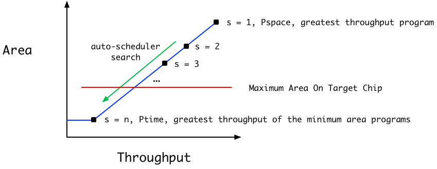

The auto-scheduler's algorithm is:
1. Compile `pseq` to the program in the space-time IR with the greatest throughput. I will refer to this program as `pspace`
    1. This is determined by rewriting every operator in `pseq` to it's space version in the space-time IR.
1. Compile `pseq` to the program in the space-time IR that is the greatest throughput of the minimum area programs. I will refer to this program as `ptime`.
    1. This is partially determined by rewriting every operator in `pseq` to it's time version in the space-time IR.
    1. There are an infinite number of least area programs because all operators can be arbitrarily underutilized with the same hardware resources.
        1. For example, `Map_t 2 0 Abs :: TSeq 2 0 Int -> TSeq 2 0` requires the same hardware and is three times higher throughput than `Map_t 2 4 Abs :: TSeq 2 4 Int -> TSeq 2 4`
        1. Adding more invalid clocks expresses the underutilized. In the above example, `Map_t 2 0` has 0 invalid clocks on its input and output. `Map_t 2 4` has 4 invalid clocks on its input and output.
    1. We use integer linear optimization to find the least area program with the least underutilization, and thus the greatest throughput.
        1. Each composition of two time operators in the space-time IR creates an equality between the producer's output valid and invalid clocks and the consumer's input valid and invalid clocks.
        1. ILP solves for the minimum number of valid and invalid clocks that satisfies all equalities.
            1. Some operators would appear to introduce non-linearity. 
            1. For example, `partition no ni io ii Int :: TSeq (no*ni) (no*ii + io*(ni+ii)) Int -> TSeq no io (TSeq ni ii Int)` would create non-linear equations.
            1. We address this issue by requiring that either `io = 0` or `ii = 0`.
            1. We will show below that this does not restrict the expressiveness of the language.
1. Let `max_slowdown = floor(throughput(Pspace) / throughput(Ptime))`. For each integer **s** from 1 to `max_slowdown`, schedule `pseq` with slowdown factor **s**. Stop at the first **s** that fits on the target chip.
    1. Scheduling with a slowdown factor is converting a program from the sequence language to one in the space-time IR that has an output throughput that is **s** times less than `pspace`.


The code for the auto-scheduler is:
```
autoscheduler :: Area -> Seq_Expr -> Space_Time_Expr
autoscheduler max_area pseq = 
    pspace = sequence_to_space_operators(pseq)

    # assume automatically solving ILP optimization problem
    ptime = sequence_to_time_operators(pseq)

    max_slowdown = floor(throughput(pspace) / throughput(ptime))
    for s in [1 .. max_slowdown]:
        pspace_time = schedule pseq pspace ptime s
        if area(pspace_time) <= max_area:
            return pspace_time
    
    fail "Unable to fit sequence program on target chip."
```

The following sections will work through the implementation of the scheduling algorithm. 

# Naive Scheduler
The naive auto-scheduler is, for each operator, apply the slowdown factor if possible by applying the appropriate rewrite rules.
If not possible or slowing down the operator is insufficient to reach the desired throughput, recur on nested operators. 

The code for the naive scheduler is:
```
naive_schedule :: Seq_Expr -> Int -> Space_Time_Expr
naive_schedule pseq s =
    map (naive_schedule_op s) (operators pseq)

naive_schedule_op s op =
    n = max (input_seq_len op) (output_seq_len op)
    if s == 1:
        sequence_to_space op
        remaining_s = 1
    else if (s % n) == 0:
        sequence_to_time op
        remaining_s = s / n
    else if (n % s) == 0:
        sequence_to_nested_time_space op s
        remaining_s = 1
    else:
        sequence_to_space op
        remaining_s = s
    
    # higher order op's include Map, Map2, and Reduce
    if is_higher_order op:
        inner = inner_op op 
        return (naive_schedule_op remaining_s inner) 
    # other operators, such as Shift, can operate on nested types
    # Need to convert those nested Seq types to TSeqs or SSeqs
    else:
       inner = inner_type op
       return (naive_schedule_type remaining_s inner)
    
```

The [motivating examples](#motivating_examples) show that this auto-scheduler does not correctly schedule programs that a user can be expected to write. 


# Motivating Examples
There are five main issues that the scheduler will have to handle:
1. **Individual Operator Rewrites** - scheduling individual, sequence operators by rewriting them to space-time operators with the desired throughput
1. **Composition** - scheduling composed operators so that the produced space-time operators have matching type signatures 
1. **Multi-Rate** - scheduling operators that accept and emit different numbers of outputs, such as `Up_1d` and `Down_1d`
1. **Nesting Manipulation** - scheduling operators that change that change the nesting of `Seq`s, such as `Partition` and `Unpartition`
1. **Composition of Multi-Rate and Nesting Manipulation** - scheduling both types of operators. This is the example that the naive scheduler cannot handle.

## Individual Operator Rewrites
This example shows the simplest pipeline that can be scheduled.
The example sequence language program is:
```
Map 4 Abs
```

Slowdown factors **s** that the rewrite rules can produce are `1,2,4`.
These are the valid **s** as they are the factors of `4`.
The following diagrams shows the process of applying the naive scheduler with these different **s**.
The first diagram is the program in the sequence language AST.
Each box represents a node in the AST. 
A box inside another box indicates a parent-child relationship.
For example, `Map 4 Abs` on the left indicates that `Map 4` is the parent node of `Abs`. 
The text below the `Map 4 Abs` is the type signature of the AST node.

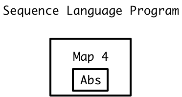

The second diagram is the program in the space-time IR AST after scheduling with `s=1`
The naive scheduler has applied the sequence\_to\_space rewrite rule to `Map 4 Abs` to produce `Map_s 4 Abs`.
The naive scheduler correctly handles this case:
1. The outputs of the programs are at the correct throughputs. 
The output type is `SSeq 4 Int`, four `Int`s in one clock. 
This is the highest possible throughput for four `Int`s.
1. The type signatures of all composed operators match. There are no composed operators.

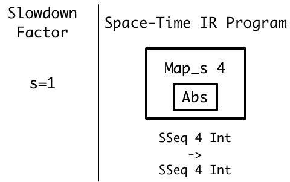

The third diagram is the program in the space-time IR AST after scheduling with `s=2`
The naive scheduler has applied the sequence\_to\_nested\_time\_space rewrite rule to `Map 4 Abs` to produce `Map_t 2 0 (Map 2 Abs)`.
The naive scheduler correctly handles this case:
1. The outputs of the programs are at the correct throughputs. 
The output type is `TSeq 2 0 (SSeq 2 Int)`, four `Int` in two clocks.
This throughput is two times smaller than the throughput of the `s=1` program with output type `SSeq 4 Int`.
1. The type signatures of all composed operators match. There are no composed operators.

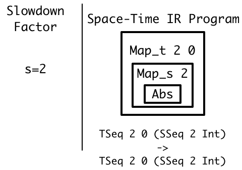

## Composition
This example demonstrates the issue of rewriting composed operators while preserving the fact that all producers and consumers have matching type signatures.
The example sequence language program is:
```
Map 4 Abs >>> Map 4 Abs
```

Slowdown factors **s** that the rewrite rules can produce are `1,2,4`.
The following diagrams shows the process of applying the naive scheduler.
The first diagram is the program in the sequence language AST.
The arrow from one operator to the next with `>>>` indicates composition.
The left operator is the producer and the right operator is the consumer.

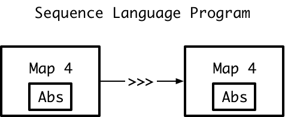

The second diagram is the program in the space-time IR AST after scheduling with `s=2`
The naive scheduler has independently applied the sequence\_to\_nested\_time\_space rewrite rule to both `Map 4 Abs` to produce `Map_t 2 0 (Map 2 Abs)`.
The naive scheduler correctly handles this case for the same reasons as the [individual operator rewrites example.](#individual-operator-rewrites)

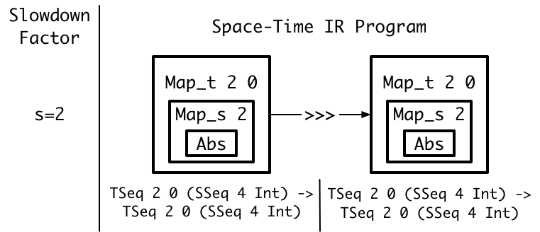

## Multi-Rate
This example demonstrates the issue of rewriting operators with different input and output invalid clocks and thus throughputs.
The example sequence language program is:
```
Select_1d 4 0 Int
```

Attainable s are `1, 2, 4`.
The following diagrams shows the process of applying the naive scheduler.
The first diagram is the program in the sequence language AST.
The type signature does not account for invalid clocks since the sequence language doesn't consider throughput.

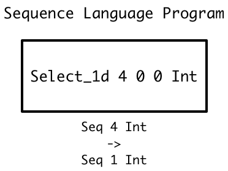

The second diagram is the program in the space-time IR AST after scheduling with `s=2`
The naive scheduler has applied the sequence\_to\_nested\_time\_space rewrite rule to `Select_1d 4 Int`.
The naive scheduler correctly handles this case for the same reasons as the [individual operator rewrites example.](#individual-operator-rewrites)
Note in this diagram the `Map_t 1 1` has one invalid clock on its input and output types. This is necessary in order to match the type produced by `Select_1d_t 2 0 0`.
The throughputs for this program are four `Int` inputs per two clocks and one `Int` output per two clocks.

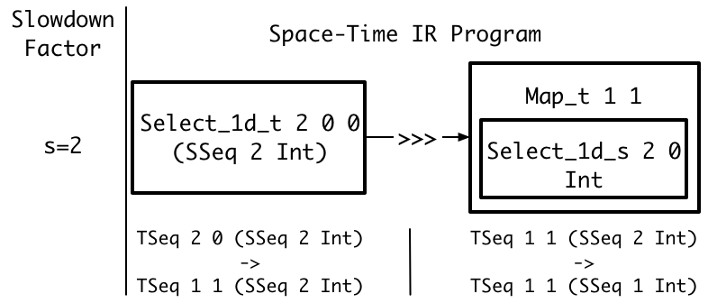

## Nesting Manipulation
This example demonstrate the issue of rewriting operators where there are different amounts of nesting on the input and output.
The example sequence language program is:
```
Unpartition 2 2 Int
```

Attainable s are `1, 2, 4`.
The following diagrams shows the process of applying the naive scheduler.
The first diagram is the program in the sequence language AST.

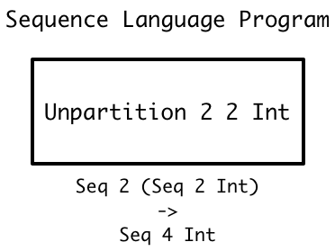

The second diagram is the program in the space-time IR AST after scheduling with `s=2`
The naive scheduler has applied the sequence\_to\_nested\_time\_space rewrite rule.
The result is an operator that does nothing.
The sequence\_to\_nested\_time\_space rewrite rule normally converts an operator so that its input and output are nested with an outer `TSeq`s and inner `SSeq`. 
Since the `Unpartition` has a nested input, the rewritten operator just propagates its inputs.
The naive scheduler correctly handles this case for the same reasons as the [individual operator rewrites example.](#individual-operator-rewrites)

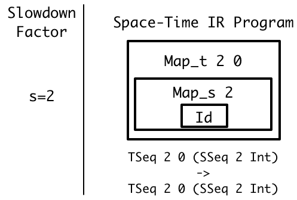

## Composition of Multi-Rate and Nesting Manipulation
This example demonstrates the issue of scheduling both types of operators while ensuring that their types compose after applying the rewrite rules.
This is the example that the naive scheduler cannot handle.
The example sequence language program is:
```
Select_1d 2 0 (Seq 2 Int) >>> Unpartition 1 2 Int 
```

Attainable s are `1, 2, 4`.
The following diagrams shows the process of applying the naive scheduler.
The first diagram is the program in the sequence language AST.

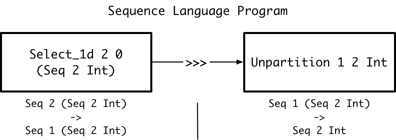

The second diagram is the program in the space-time IR AST after scheduling with `s=2`
The naive scheduler has applied the sequence\_to\_time rewrite rule to `Select_1d 2 0 (Seq 2 Int)` while converting its `Seq 2 Int` to an `SSeq 2 Int`.
This produces a `Select_1d_t 2 0 0 (SSeq 2 Int)` with a throughput that is two times less than the throughput of the fully parallel `Select_1d_s 2 0 (SSeq 2 Int)`
The naive scheduler has applied the sequence\_to\_time rewrite rule to `Unpartition 1 2 Int`, producing a `Unpartition_t_tt 1 2 0 0 Int`.
This operator has a throughput that is two times less than the throughput of the fully parallel `Unpartition_s_ss 1 2 Int`.
However, the operators' types don't match and the produced hardware cannot be composed.
The `Select_1d_t` has an output of two `Int` every other clock. 
The `Unparititon_t_tt` is expecting an `Int` input every clock.
Thus, the naive scheduler has failed to produce valid hardware.

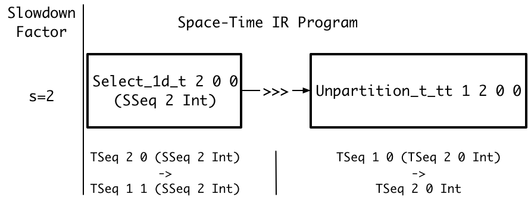

# Scheduling Algorithm
The scheduling algorithm is:
1. Given: 
    1. `pseq` - the program in the sequence language
    1. `pspace` - the program in the space-time IR with the greatest throughput
    1. `ptime` - he program in the space-time IR that is the greatest throughput of the minimum area programs
    1. `s` - the slowdown factor
1. Compute a space-time IR output type for `pseq` that is `s` times slower than the output type of `pspace`. 
1. Rewrite the `pseq` AST to produce the computed output type using the following visitor pattern. 
The first node to visit is the last node in the `pseq` AST.
   1. Rewrite the current operator `op_cur` to match it's slowed output type.
   1. Compute `op_cur`'s input type after rewriting
   1. Recur on all operators that produce input for `op_cur`.
   The output types for those operators are the input types to `op_cur`.

The code for the scheduler is:
```
schedule :: Seq_Expr -> Space_Time_Expr -> Space_Time_Expr -> Int -> Space_Time_Expr
schedule pseq pspace ptime s =
    ot_slowed = compute_slowed_output_type pseq ptime s
    return (rewrite_to_match_output_type pseq ot_slowed)
```

## Slowed Output Type Computation
The algorithm for performing step 2 of the above scheduling algorithm is
1. Let `ot_time` be the output type of `ptime`
1. Let `ot_space` be the output type of `pspace`
1. Let `ot_slowed` be the output type to emit. 
It is slowed down from `pspace`'s output type by `s` times.
1. Slowdown pass 1: try to slow down without underutilizing.
For each `SSeq n t` in `ot_space` starting with the outer most one:
1. Slowdown pass 2: if not able to produce a sufficiently slowed down `ot_slowed` in pass 1, now try slowing down with underutilization.
    1. slow it down to `TSeq n 0 t` if `s` is divisible by `n`.
    1. slow it down to `TSeq no 0 (SSeq ni t)` if `n` and `s` share common factors.
        1. `no` is the common factors of `n` and `s`
        1. `ni = n / no`
For each `TSeq n i t` in `ot_time` starting with the outer most one:
    1. slow it down to ime, if `n+i` and `s` share common factors, the replace the `SSeq` with `TSeq n i (SSeq 1 t)`.

The code is:
```
compute_slowed_output_type :: Seq_Expr -> Space_Time_Expr -> Int -> Space_Time_Type 
compute_slowed_output_type pseq ptime s = 
    s_remaining_factors = prime_factorization(s)
    ot_time = get_output_type ptime
    ot_slowed = []
    ot_slowed_temp = []

    -- Slowdown Pass 1
    for (TSeq n i) in (ot_time):
        n_factors = prime_factorization n
        if Set.intersect n_factors s_remaining_factors != Set.empty:
            slowdown_factors = Set.intersect n_factors s_remaining_factors
            s_remaining_factors = Set.difference s_remaining_factors slowdown_factors 
            slowdown = Set.product slowdown_factors
            no = slowdown
            ni = n / no
            io = 0
            s_remaining_factors = Set.difference s_remaining_factors slowdown_factors
            if i == 0 && no == n:
                ot_slowed_temp += TSeq no io 
            else:
                ot_slowed_temp += Split(TSeq no io, SSeq ni) 
        else :
            ot_slowed_temp += SSeq ni

    -- Slowdown Pass 2
    for (TSeq n i, pass1_result) in (zip ot_time ot_slowed_temp)
        max_slowdown = (n+i / time pass1_result)
        max_slowdown_factors = prime_factorization max_slowdown
        if Set.intersect max_slowdown_factors s_remaining_factors != S.empty:
            slowdown_factors = Set.intersect max_slowdown_factors s_remaining_factors
            slowdown = Set.product slowdown_factors
            s_remaining_factors = Set.difference s_remaining_factor slowdown_factors
            ot_slowed += add_invalid_clocks pass1_result slowdown
        else 
            ot_slowed += pass1_result
    
    return ot_slowed
```

## Rewrite AST To Match Output Type
The algorithm for performing step 3 of the above scheduling algorithm is:
```
rewrite_to_match_output_type :: Seq_Expr -> Space_Time_Type -> Int -> Space_Time_Expr
rewrite_to_match_output_type op ot_slowed = 
    if ot_slowed[0] == SSeq n:
        op_slowed = sequence_to_space op
    else if ot_slowed[0] == TSeq n i:
        op_slowed = sequence_to_time op
    else:
        op_slowed = sequence_to_nested_time_space op ot_slowed[0]

    # higher order op's include Map, Map2, and Reduce
    if is_higher_order op:
        inner_op = inner_op op 
        inner_op_slowed = rewrite_to_match_output_type inner_op ot_slowed[1:]
        op_slowed = update_inner_op op_slowed inner_op_slowed
    # other operators, such as Shift, can operate on nested types
    # Need to convert those nested Seq types to TSeqs or SSeqs
    else:
        inner_type_slowed = ot_slowed[1:]
        op_slowed = update_inner_type op_slowed inner_type_slowed
        
    op_slowed_input_types = get_input_types op_slowed
    op_input_exprs = get_input_exprs op_slowed
    op_slowed_input_exprs = []
    for (input_type, input_expr) in (zip op_slowed_input_types op_slowed_input_exprs):
        op_slowed_input_exprs += rewrite_to_match_output_type input_expr input_type
    
    op_slowed = update_op_inpute op_slowed op_slowed_input_exprs
    return op_slowed
```

# What Are The Problems Facing My Scheduling
## Areas That I Haven't Addressed
1. reshape operator 
1. dropping elements
1. flipping
1. making different Nesting but same throughput types equivalent 
1. delays

## Core Issues
1. I haven't dealt with operators that change the shape of the matrix and thus require large memories
1. I haven't dealt with operators that don't have inputs/outputs that are factors of each other
1. The space-time IR cannot consider just throuhgput without delay while giving a good cost model

# Ideal Scheduler

## Composition of Multi-Rate With Nested Operators
This example demonstrates the issue of scheduling multiple operators while preserving nesting.
```
Select_1d 4 0 (Seq 2 Int) >>> Map 1 (Map 2 Abs)
```

Attainable s are `1, 2, 4`.
The first diagram is the program in the sequence language AST.


An intuitive but suboptimal space-time IR program that implements this pipeline with a slowdown of `s=4` is:
```
Select_1d_t 4 0 0 (SSeq 2 Int) >>> Map_t 1 0 (Map_s 2 Abs)
```

A diagram of the produced hardware is below. 
The components of the diagram are:
1. Wire labels indicating the data types communicated between operators.
For example, the wire into the `Select_1d_t` is `TSeq 4 0 (SSeq 2 Int)`.
1. Titles at the top of each box indicating the space-time IR expression that produced the hardware.
For example, the box labeled `Select_1d_t 4 0 (SSeq 2 Int)` is the space-time IR expression that produced the desired hardware in that box.
1. Hardware inside each box. Each hardware component has it's own box.
For example, the box labeled `Select_1d_t 4 0 (SSeq 2 Int)` has:
    1. `Counter 4` to track the current element of the input.
    1. `Eq 0` to select only the 0th element of the input.
    1. An output that merges the `Eq 0`'s output and the input. 
    This drop 3 of the input elements by indicating invalid on the output wire.


The below space-time IR program is a superior implementation of the same pipeline with a slowdown of `s=4`.
```
Select_1d_t 2 0 0 (SSeq 2 (TSeq 2 0 Int)) >>> Map_t 1 1 (Select_1d_s 1 0 (TSeq 2 0 Int)) >>> Map_t 1 1 (Map_s 1 (Map_t 2 0 Abs))
```

The hardware diagram below is more efficient as it uses one less `Abs` unit.
Additionally, the `Select_1d` requires no more resources in the program compared to the prior one.
The `Select_1d_t` has the same size counter as it still covers 4 total clocks, 2 of which are valid for the first `SSeq 2 (TSeq 2 0 Int)` input.
The `Select_1d_s` requires no hardware.


## Diamond Pattern
This example demonstrates the issue of scheduling a DAG with a diamond pattern.
This example is a rolling window sum of two pixels.
The `Abs` is added to ensure both paths in the diamond have an operator.

```
rolling_sum n input = do
    let shifted_1 = Shift n 1 Int input
    let abs_input = Map n Abs input
    let tupled_window = Map2 n Tuple abs_input shifted_1
    let seq_window = Tuple_To_Seq n (Int x Int) tupled_window
    return (Map n (Reduce 2 Add) seq_window)

rolling_sum 4 [0,1,2,3]
```

Attainable s are `1, 2, 4, and 8`.
The first diagram is the program in the sequence language AST.
In the diagram, all operators are specialized for `n=10` and for the input.
The diagram uses different wire labels compared to above sequence language diagrams.
Unlike the prior programs, this one is not written in point-free notation. 
Therefore, the wires are labeled with variable names rather than the `>>>` combinator.

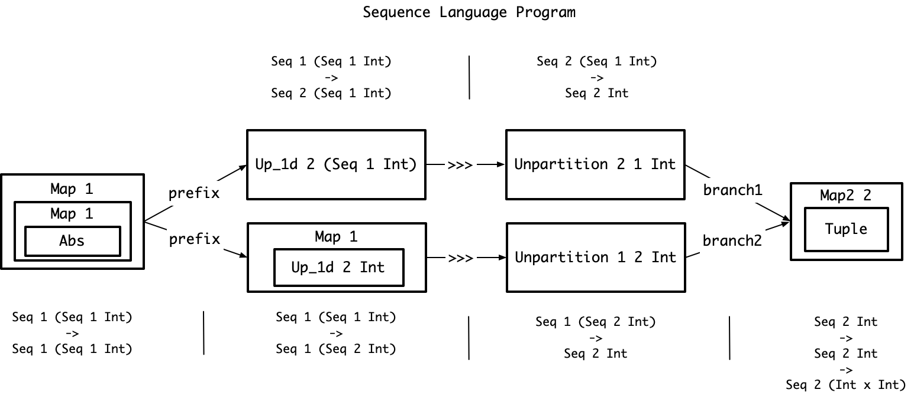


The below space-time IR program implements the pipeline with a slowdown of `s=8`.
The `Serialize` converts the `SSeq` produced by the `Tuple_To_SSeq` to a `TSeq` that can be processed by the `Reduce_t`.
```
rolling_sum_t n input = do
    let shifted_1 = Shift_t 4 4 1 Int input
    let abs_input = Map_t 4 4 Abs input
    let tupled_window = Map2_t 4 4 Tuple abs_input shifted_1
    let tseq_of_sseq_window = Map_t 4 4 Tuple_To_SSeq tupled_window
    let seq_window = Serialize 4 0 2 0 Int tseq_of_sseq_window
    return (Map_t 4 0 (Reduce_t 2 0 Add) seq_window)

rolling_sum_t 4 [0,1,2,3]
```

The diagram below shows the hardware necessary to implement this space-time IR program.
Note that the output of the reduce is a combination of the register and the counter.
The register emits the value of the summation.
The counter provides the valid signal.
Since this is a `Reduce_t 2 0 Add :: TSeq 2 0 Int -> TSeq 1 1 Int`, it is only valid every other clock.

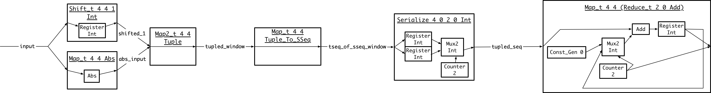
```
nested_shift input = 
    let inputs_to_shift = Map_t 2 (Select_1d_s 2 0) input
    let inputs_to_pass = Map_t 2 (Select_1d_s 2 1) input
    let shifted_values = Shift_t 2 1 inputs_to_shift
    let tupled_outputs = Map2_t 2 Tuple shiftred_values inputs_to_pass
    return (Map_t 2 (Tuple_To_SSeq 2) tupled_outputs)

rolling_sum_ppar n input = do
    let shifted_1 = nested_shift input
    let abs_input = Map_t 2 0 (Map_s 2 Abs) input
    let tupled_window = Map2_t 2 0 (Map2_s n Tuple) abs_input shifted_1
    let seq_window = Map2_t 2 0 (Map_s 2 Tuple_To_SSeq) tupled_window
    return (Map_t 2 0 (Reduce_s 2 Add) seq_window)
Select_1d_t 2 0 0 (SSeq 2 (TSeq 2 0 Int)) >>> Map_t 1 1 (Select_1d_s 1 0 (TSeq 2 0 Int)) >>> Map_t 1 1 (Map_s 1 (Map_t 2 0 Abs))
```

## Composition of Multi-Rate With Nested Operators and Memories
This example demonstrates the issue of scheduling multiple operators while preserving nesting and using memories.
```
linebuffer_3_1d n input = do
    let first_shift = Shift n 1 input
    let second_shift = Shift n 1 first_shift
    let tupled_outputs = Map2 n Tuple (Map2 n Tuple input first_shift) second_shift
    return (Tuple_To_Seq n tupled_outputs)

linebuffer_3_1d 10 >>> 
Map 10 (
    Map2 3 Tuple (Const_Gen [1,2,1]) >>> 
    Map 3 Mul >>>
    Reduce 3 Add >>> 
    Map2 1 Tuple (Const_Gen [4]) >>>
    Map 1 Div
)
```

`Select_1d` doesn't require a memory as it just emits or doesn't emit the input.
`Up_1d` requires a memory as it must repeat.
