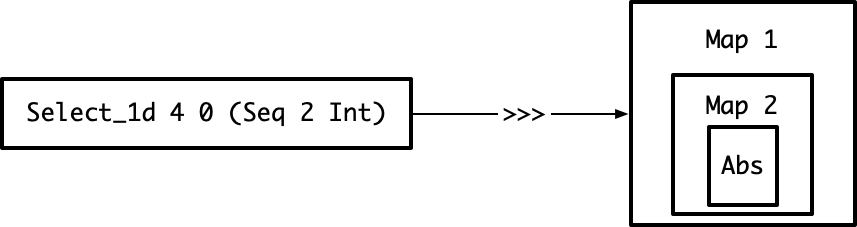
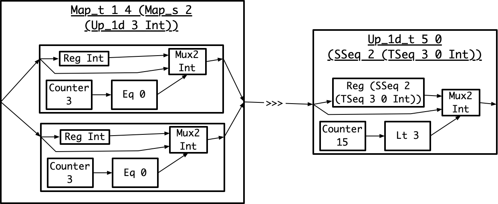
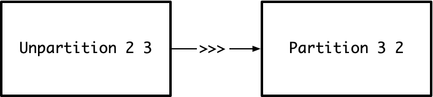

# Scheduling
The goal of this document is:
1. Define auto-scheduling and scheduling
1. List the motivating examples for the scheduling algorithm
1. Define the scheduling algorithm
   
# Auto-Scheduling and Scheduling Definitions
For a program `pseq` in the sequence language, the auto-scheduler searches for the highest throughput program in the space-time IR that fits within the target chip's constraints.

The below image is a visualization of the auto-scheduler. 
The blue line is the auto-scheduler's search space: the set of program's in the space-time IR that `Pseq` can be converted into. 
The red line is the maximum amount of area on the target chip.
The green line is the auto-scheduler's search process from the maximum throughput space-time IR program, `Pspace`, to the minimum area space-time IR program, `Ptime`.
The goal is the find the right-most point on the blue line that is below the red line.
The auto-scheduler accomplishes this goal by walking along the blue line in the direction indicated by the green line. 


The auto-scheduler's algorithm is:
1. Compile `pseq` to the program in the space-time IR with the greatest throughput. I will refer to this program as `pspace`
    1. This is determined by rewriting every operator in `pseq` to it's space version in the space-time IR.
    1. This program will process the entire input in one clock cycle during steady-state.
1. Compile `pseq` to the program in the space-time IR that is the greatest throughput of the minimum area programs. I will refer to this program as `ptime`.
    1. This is partially determined by rewriting every operator in `pseq` to it's time version in the space-time IR.
    1. There are an infinite number of least area programs because all operators can be arbitrarily underutilized with the same hardware resources.
        1. For example, `Map_t 2 0 Abs :: TSeq 2 0 Int -> TSeq 2 0` requires the same hardware and is three times higher throughput than `Map_t 2 4 Abs :: TSeq 2 4 Int -> TSeq 2 4`
        1. Adding more invalid clocks expresses the underutilized. In the above example, `Map_t 2 0` has 0 invalid clocks on its input and output. `Map_t 2 4` has 4 invalid clocks on its input and output.
    1. This program is the one with the minimum number of invalids.
1. Let `max_time = time(ptime))`. For each integer **s** from 1 to `max_time`, schedule `pseq` with slowdown factor **s**. 
This program `pspace_time` will have a throuhgput **s** times less than that of `pspace`. 
`pspace_time` will take **s** clock cycles to process an the input during steady-state. 
Stop at the first **s** that fits on the target chip.
    1. Scheduling with a slowdown factor is converting a program from the sequence language to one in the space-time IR that has an output throughput that is **s** times less than `pspace`.
    1. Note that throughput here is steady-state throughput. We are not considering delays.


The code for the auto-scheduler is:
```
autoscheduler :: Area -> Seq_Expr -> Space_Time_Expr
autoscheduler max_area pseq = 
    pspace = sequence_to_space_operators(pseq)

    # assume automatically solving ILP optimization problem
    ptime = sequence_to_time_operators(pseq)

    max_slowdown = floor(throughput(pspace) / throughput(ptime))
    for s in [1 .. max_slowdown]:
        pspace_time = schedule pseq pspace ptime s
        if area(pspace_time) <= max_area:
            return pspace_time
    
    fail "Unable to fit sequence program on target chip."
```

The following sections will work through the implementation of the scheduling algorithm. 

# Scheduling Problem Definition
An Aetherling program is a DAG.
The nodes `N` are the operators. A node from a higher-order operator, like a `Map`, may contain a sub-DAG.
The edges `E` are the producer-consumer relationships between nodes.
There is one output node `N_out`. This node is not composed with any consumers.
The output type of the program is equal to the output type of the `N_out`.

The goal of scheduling is: given a slowdown factor **s**, rewrite all of the nodes from the sequence language to the space-time IR so that:
    1. `N_out` has the desired throughput that is **s** times slower than its output throuhgput in `pspace`
    2. Minimize the compute and memory resources needed by the space-time IR nodes

# Naive Scheduler

The naive auto-scheduler is, for each operator, apply the slowdown factor if possible by applying the appropriate rewrite rules.
If not possible or slowing down the operator is insufficient to reach the desired throughput, recur on nested operators. 

The code for the naive scheduler is:
```
schedule :: Seq_Expr -> Space_Time_Expr -> Space_Time_Expr -> Int -> Space_Time_Expr
schedule pseq pspace ptime s =
    n_xs = get_all_nodes pseq
    map (\n -> rewrite_with_slowdown n pspace ptime s) n_xs
```

The [naive scheduler examples](#naive_scheduler_examples) show that this attempt fails to correctly schedule programs that compose multi-rate and nested operators. 


# Naive Scheduler Examples
The below examples show four issues that the scheduler will have to handle:
1. **Individual Operator Rewrites** - scheduling individual, sequence operators by rewriting them to space-time operators with the desired throughput
1. **Composition** - scheduling composed operators so that the produced space-time operators have matching type signatures 
1. **Multi-Rate** - scheduling operators that accept and emit different numbers of outputs, such as `Up_1d` and `Down_1d`
1. **Composition of Multi-Rate and Nesting Manipulation** - scheduling the composition of nested and multi-rate operators. This is the example that the naive scheduler cannot handle.

## Individual Operator Rewrites
This example shows the simplest pipeline that can be scheduled.
The sequence language program is:
```
Map 4 Abs
```

Slowdown factors **s** that the rewrite rules can produce are `1,2,4`.
These are the valid **s** as they are the factors of `4`.
The following diagrams shows the process of applying the naive scheduler with these different **s**.
The first diagram is the program in the sequence language AST.
Each box represents a node in the AST. 
A box inside another box indicates a parent-child relationship.
For example, `Map 4 Abs` on the left indicates that `Map 4` is the parent node of `Abs`. 
The text below the `Map 4 Abs` is the type signature of the AST node.


The second diagram is the program in the space-time IR AST after scheduling with `s=1`
The naive scheduler has applied the sequence\_to\_space rewrite rule to `Map 4 Abs` to produce `Map_s 4 Abs`.
The naive scheduler correctly handles this case:
1. The outputs of the programs are at the correct throughputs. 
The output type is `SSeq 4 Int`, four `Int`s in one clock. 
This is the highest possible throughput for four `Int`s.
1. The type signatures of all composed operators match. There are no composed operators.


The third diagram is the program in the space-time IR AST after scheduling with `s=2`
The naive scheduler has applied the sequence\_to\_nested\_time\_space rewrite rule to `Map 4 Abs` to produce `Map_t 2 0 (Map 2 Abs)`.
The naive scheduler correctly handles this case:
1. The outputs of the programs are at the correct throughputs. 
The output type is `TSeq 2 0 (SSeq 2 Int)`, four `Int` in two clocks.
This throughput is two times smaller than the throughput of the `s=1` program with output type `SSeq 4 Int`.
1. The type signatures of all composed operators match. There are no composed operators.


## Composition
This example demonstrates the issue of rewriting composed operators while preserving the fact that all producers and consumers have matching type signatures.
The sequence language program is:
```
Map 4 Abs >>> Map 4 Abs
```

Slowdown factors **s** that the rewrite rules can produce are `1,2,4`.
The following diagrams shows the process of applying the naive scheduler.
The first diagram is the program in the sequence language AST.
The arrow from one operator to the next with `>>>` indicates composition.
The left operator is the producer and the right operator is the consumer.


The second diagram is the program in the space-time IR AST after scheduling with `s=2`
The naive scheduler has independently applied the sequence\_to\_nested\_time\_space rewrite rule to both `Map 4 Abs` to produce `Map_t 2 0 (Map 2 Abs)`.
The naive scheduler correctly handles this case for the same reasons as the [individual operator rewrites example.](#individual-operator-rewrites)


## Multi-Rate
This example demonstrates the issue of rewriting operators with different input and output invalid clocks and thus throughputs.
The sequence language program is:
```
Select_1d 4 0 Int
```

Attainable s are `1, 2, 4`.
The following diagrams shows the process of applying the naive scheduler.
The first diagram is the program in the sequence language AST.
The type signature does not account for invalid clocks since the sequence language doesn't consider throughput.


The second diagram is the program in the space-time IR AST after scheduling with `s=2`
The naive scheduler has applied the sequence\_to\_nested\_time\_space rewrite rule to `Select_1d 4 Int`.
The naive scheduler correctly handles this case for the same reasons as the [individual operator rewrites example.](#individual-operator-rewrites)
Note in this diagram the `Map_t 1 1` has one invalid clock on its input and output types. This is necessary in order to match the type produced by `Select_1d_t 2 0 0`.
The throughputs for this program are four `Int` inputs per two clocks and one `Int` output per two clocks.


## Composition of Multi-Rate and Nesting
This example demonstrates the issue of scheduling multi-rate and nested operators while ensuring that their types compose after applying the rewrite rules.
The naive scheduler cannot handle this example
The sequence language program is:
```
Select_1d 2 0 (Seq 2 Int) >>> Map 1 (Map 2 Abs)
```

Attainable s are `1, 2, 4`.
The following diagrams shows the process of applying the naive scheduler.
The first diagram is the program in the sequence language AST.


The second diagram is the program in the space-time IR AST after scheduling with `s=2`
The naive scheduler has applied the sequence\_to\_time rewrite rule to `Select_1d 2 0 (Seq 2 Int)` while converting its `Seq 2 Int` to an `SSeq 2 Int`.
This produces a `Select_1d_t 2 0 0 (SSeq 2 Int)` with a throughput that is two times less than the throughput of the fully parallel `Select_1d_s 2 0 (SSeq 2 Int)`
The naive scheduler has applied the sequence\_to\_time rewrite rule to both `Map` in `Map 1 (Map 2 Abs)`, producing a `Map_t 1 0 (Map_t 2 0 Abs)`.
This operator has a throughput that is two times less than the throughput of the fully parallel `Map_s 1 (Map_s 2 Abs)`.
However, the operators' types don't match and the produced hardware cannot be composed.
The `Select_1d_t` has an output of two `Int` every other clock. 
The `Map_t 1 0 (Map_t 2 0 Abs)` has an input of an `Int` input every clock.
Thus, the naive scheduler has failed to produce valid hardware.


# Recursive Scheduler
The next attempt at a scheduling algorithm addresses the composition of multi-rate and nesting manipulation example by considering dependencies between composed operators.
It walks the expression tree from output to input.
During this walk, it schedules each operator so that the types of composed operators match.
The scheduling algorithm is:
```
schedule :: Seq_Expr -> Space_Time_Expr -> Space_Time_Expr -> Int -> Space_Time_Expr
schedule pseq pspace ptime s =
    n_out = get_output_node pseq
    n_out_st = rewrite_with_slowdown n_out pspace ptime s
    n_out_st_input_types = get_input_types n_out_st
    n_out_producers = get_producers n_out
    set_producers n_out_st 
        [schedule_op n_out_producers[i] n_out_st_input_types[i] | i <- 0..len(n_out_producers)]
    return n_out_st

schedule_op :: Seq_Expr -> Space_Time_Type -> Space_Time_Expr
schedule_op n consumer_type =
    n_st = rewrite_with_output_type n consumer_type
    n_st_input_types = get_input_types n_st
    n_producers = get_producers n
    set_producers n_st 
        [schedule_op n_producers[i] n_st_input_types[i] | i <- 0..len(n_producers)]
    return n_st
```

This algorithm has two main limitations.
First, it cannot handle DAGs. 
It treats expressions as trees and so ignores dependencies between nodes that appear multiple times in a DAG.
The [recursive scheduler examples](#recursive-scheduler-examples) will demonstrate this issue.
Second, it only evaluates one of multiple possible schedules for a given **s** and `pseq`.
For example, there are multiple possible ways to rewrite an operator to match a slowdown.
`rewrite_with_slowdown` arbitrarily picks one.
The recursive, DAG-aware scheduler will address both of these issues.

# Recursive Scheduler Examples

## Composition of Multi-Rate and Nesting Manipulation
This example demonstrates the issue of scheduling both types of operators while ensuring that their types compose after applying the rewrite rules.
Unlike the naive scheduler, the recursive scheduler can handle this example.
The sequence program is:
```
Select_1d 2 0 (Seq 2 Int) >>> Map 1 (Map 2 Abs)
```

The result from scheduling for `s=2` with the recursive algorithm is:


The recursive scheduler first applies `rewrite_with_slowdown` to `Map 1 (Map 2 Abs)`, the output node of the program.
This will try to slowdown the node without introducing invalids, so it produces `Map_s 1 (Map_t 2 0 Abs)`.
`rewrite_with_slowdown` knows that slowing down the outer `Map 1` would require introducing invalids because `ptime` shows that the result of performing this slowdown is `Map_t 1 1`.
Then, the algorithm applies `rewrite_with_output_type` to `Select_1d 2 0 (Seq 2 Int)` with output type `SSeq 1 (TSeq 2 0 Int)`.
The result is `Select_1d_s 2 0 (TSeq 2 0 Int)`.
The `Select_1d_s` has an output of an `Int` every clock.
The `Map_s` has an input of an `Int` every clock.
Thus, the recursive scheduler has produced valid hardware where the naive one failed.

## Diamond
This example demonstrates the issue of scheduling a DAG with a diamond pattern: the input is used on two separate branches which are later merged.
The recursive scheduler cannot handle this example.
The sequence language program is:
```
diamond input =
    let prefix = Map 1 (Map 1 Abs) input
    let branch1 = (Up_1d 2 (Seq 1 Int) >>> Unpartition 2 1 Int) prefix
    let branch2 = (Map 1 (Up_1d 2 Int) >>> Unpartition 1 2 Int) prefix
    Map2 2 Tuple branch1 branch2
```

Attainable s are `1, 2, 4`.
The following diagrams shows the process of applying the naive scheduler.
The first diagram is the program in the sequence language AST.


The second diagram is the program in the space-time IR AST after scheduling with `s=2`
The recursive scheduler has scheduled each branch independently. 
For each branch, `rewrite_with_output_type` slows the `Up_1d` because that minimizes underutilization. 
As a result, `branch1` wants to rewrite `prefix` to `Map_t 1 1 (Map_s 1 Abs)` while `branch2` wants to rewrite prefix to `Map_s 1 (Map_t 1 1 Abs)`.
This is invalid hardware as `prefix` can only be one implementation.


# Recursive, Memoized, Branching Scheduler
The final scheduling algorithm addresses the diamond issue while also exploring multiple schedules.
It performs the same walk of the expression tree as the above, recursive scheduling algorithm.
However, it memoizes the calls to `schedule_op`.
Therefore, if a node is scheduled once in one part of the expression tree, it will not be scheduled different in a different part of the expression tree.
As a result, `schdule_op` will need to handle the case where a recursive call to `schedule_op` does not return a producer with the expected type.
In this case, `Reshape`s are added where necessary to fix types.
`Reshape`s are also used to explore multiple possible schedules.
For each stage in the expression tree, rather than rewriting an operator to match the consumer's type, the operator may produce any other type of the same throuhgput and apply a `Reshape` to convert between the two.
The `schedule_op` explores all such schedules by returning a list of Space_Time_Expr.
Each element in the list is a different `Reshape`.
The scheduling algorithm is:
```
schedule :: Seq_Expr -> Space_Time_Expr -> Space_Time_Expr -> Int -> Space_Time_Expr
schedule pseq pspace ptime s =
    n_out = get_output_node pseq
    n_out_st_xs = rewrite_with_slowdown n_out pspace ptime s
    n_out_st_input_type_xss = map get_input_types n_out_st_xs
    n_out_producer_xs = get_producers n_out
    n_out_st_producer_xss_maybe_wrong_type =
        [[memo schedule_op n_out_producer_xs[j] n_out_st_input_types_xss[i][j] | j <- 0..len(n_out_producers)] 
           | i <- 0..len(n_out_st_xs) ]
    n_out_st_producers_xss = map2 (map2 (add_reshape_to_match)) n_out_st_producers_xss_maybe_wrong_type n_out_st_input_type_xss
    map2 set_producers n_out_st_xs n_out_st_input_type_xss
    return n_out_st_xs

schedule_op :: Seq_Expr -> Space_Time_Type -> [Space_Time_Expr]
schedule_op n consumer_type =
    (reshapes, producer_types) = generate_all_possible_reshapes consumer_type
    n_st_xs = map2 rewrite_with_output_type reshapes producer_types
    n_st_input_type_xss = map get_input_types n_st_xs
    n_producer_xs = get_producers n
    n_st_producer_xss_maybe_wrong_type =
        [[memo schedule_op n_producer_xs[j] n_st_input_types_xss[i][j] | j <- 0..len(n_producers)] 
           | i <- 0..len(n_st_xs) ]
    n_st_producers_xss = map2 (map2 (add_reshape_to_match)) n_st_producers_xss_maybe_wrong_type n_st_input_type_xss
    map2 set_producers n_st_xs n_st_input_type_xss
    return n_st_xs
```

# Recursive, Memoized, Branching Scheduler
## Diamond
This example demonstrates the issue of scheduling a DAG with a diamond pattern: the input is used on two separate branches which are later merged.
Unlike the recursive scheduler, the recursive, memoized, branching scheduler can handle this example.

The sequence language program is:
```
diamond input =
    let prefix = Map 1 (Map 1 Abs) input
    let branch1 = (Up_1d 2 (Seq 1 Int) >>> Unpartition 2 1 Int) prefix
    let branch2 = (Map 1 (Up_1d 2 Int) >>> Unpartition 1 2 Int) prefix
    Map2 2 Tuple branch1 branch2
```

The result from scheduling for `s=2` with the recursive, memoized, branching algorithm is:


The algorithm schedules `branch1` first. 
Therefore, it schedules `prefix` to match `branch1`'s nesting structure.
When the algorithm schedules `branch2`, the memoization returns the prior scheduling of `prefix` to match `branch1`.
The scheduler adds a `Reshape` to address the mismatch between the output type of `prefix` and the input type of `branch2`, 

# Rewriting An Operation For An Output Type
There are three ways to lower an operator from the sequence language to the space-time IR:
1. Fully Sequential - the operator is rewritten using the sequence-to-time rewrite rules that it's input and output types are `TSeq`.
1. Fully Parallel - the operator is rewritten using the sequence-to-space rewrite rules that it's input and output types are `SSeq`
1. Partially Parallel - the operator is rewritten using the nesting, sequence-to-time, and sequence-to-space rewrite rules so that it's input and output types are `TSeq (SSeq)`

These options are defined for each operator in [the basic document's rewrite section](Basic.md#rewrites).
The implementation of `rewrite_with_output_type` must be able to handle all three of those cases:

```
rewrite_with_output_type :: Seq_Expr -> Space_Time_Type -> Space_Time_Expr
rewrite_with_output_type n out_st_type =
    hd_out_st_type : tl_out_st_type = out_st_type
    if (is_sseq hd_out_st_type):
        n_st = sequence_to_space n hd_out_st_type
    if (is_tseq hd_out_st_type):
        n_st = sequence_to_time n hd_out_st_type
    if (is_tseq_sseq hd_out_st_type):
        n_st = nest_then_to_space_time n hd_out_st_type
    
    -- schedule the sub-DAGs of higher order operators such as Map and Reduce
    if (is_higher_order n):
       subgraph = get_output_node (get_dag n)
       subgraph_st = schedule_op subgraph tl_out_st_type
       set_subgraph n_st subgraph_st
    -- otherwise, if operator is parameterized by a type, rewrite that type
    -- must be custom for each operator as the output type doesn't always equal
    -- the input type
    else if (is_parameterized_by_type n):
       type_param = get_type_param n
       type_param_st = rewrite_type type_param tl_out_st_type
       set_type_param n_st type_param_st

    return n_st
```


# Rewriting An Operation For A Slowdown
As stated in the [above section](#rewriting-an-operation-for-an-output-type), there are three ways to lower an operator from the sequence language to the space-time IR.
The version of `rewrite_with_slowdown` that provides all possible rewrites of an operation for a slowdown is implemented in two steps:
1. Find all possible rewrites of the operator's output type with the desired throuhgput
1. For each rewrite of the operator's output type, apply `rewrite_with_output_type`

**NOTE:** Kayvon, I know you don't like this approach. 
However, it is simpler than rewriting the operator. 
The operators may have subgraphs. 
Rewriting the output types avoids handling the subgraphs.

```
rewrite_with_slowdown :: Seq_Expr -> Space_Time_Expr -> Space_Time_Expr -> Int -> Space_Time_Expr
rewrite_with_slowdown n pspace ptime s =
    s_factors = factorize s
    n_out_type = get_output_type n

    -- all possible distributions of all factors of slowdown amongst the layers of n_out_type
    type_factor_combinations_xs = get_all_distributions_of_factors n_out_type s_factors

    -- only allow valid slowdowns
    n_out_st_types_xs = rewrite_type_for_valid_slowdowns n_out_type type_factor_ccombinations_xs ptime

    n_st_xs = map (rewrite_with_output_type n) n_out_st_types_xs
    return n_st_xs
```

## Valid Slowdowns For a Layer
The ways to slowdown a `Seq n` by `s_p` relative to the fully parallel `SSeq n` with `i_max` maximum invalid clocks are:
1. If `1 == s_p`, then `SSeq n`
1. If `(n+i_max) == s_p`, then `TSeq n i_max`
1. If `n % s_p == 0`, then `TSeq s_p 0 (SSeq (n / s_p))`
1. If `(n+i_max) >= s_p == 0`, then need to slowdown so that takes `s_p` clocks. There are multiple possible choices for the resulting `TSeq no io (SSeq ni)`. To find the best answer (least underutilization):
    1. `no * ni == n`
    1. `no + io == s_p`
    1. `io <= i_max`
    1. min `io` as want minimum underutilization
    1. Solution
        1. `no = n / ni`
        1. `(n/ni) + io == s_p`
            1. solve this by - trying all the divisors of n from smallest to largest. 
            1. take smallest `ni` such that `io` is a non-negative integer and the other constraints hold.
            1. this will give least underutilization for the given throughput

If none of the above conditions hold, then `s_p` is not a valid slowdown. 
Either it's too large or the divisibility conditions don't hold for applying the rewrite rules.


# End Of Current Draft IGNORE BELOW
## Slowed Output Type Computation
The algorithm for performing step 2 of the above scheduling algorithm is
1. Let `ot_time` be the output type of `ptime`
1. Let `ot_space` be the output type of `pspace`
1. Let `ot_slowed` be the output type to emit. 
It is slowed down from `pspace`'s output type by `s` times.
1. Slowdown pass 1: try to slow down without underutilizing.
For each `SSeq n t` in `ot_space` starting with the outer most one:
1. Slowdown pass 2: if not able to produce a sufficiently slowed down `ot_slowed` in pass 1, now try slowing down with underutilization.
    1. slow it down to `TSeq n 0 t` if `s` is divisible by `n`.
    1. slow it down to `TSeq no 0 (SSeq ni t)` if `n` and `s` share common factors.
        1. `no` is the common factors of `n` and `s`
        1. `ni = n / no`
For each `TSeq n i t` in `ot_time` starting with the outer most one:
    1. slow it down to ime, if `n+i` and `s` share common factors, the replace the `SSeq` with `TSeq n i (SSeq 1 t)`.

The code is:
```
compute_slowed_output_type :: Seq_Expr -> Space_Time_Expr -> Int -> Space_Time_Type 
compute_slowed_output_type pseq ptime s = 
    s_remaining_factors = prime_factorization(s)
    ot_time = get_output_type ptime
    ot_slowed = []
    ot_slowed_temp = []

    -- Slowdown Pass 1
    for (TSeq n i) in (ot_time):
        n_factors = prime_factorization n
        if Set.intersect n_factors s_remaining_factors != Set.empty:
            slowdown_factors = Set.intersect n_factors s_remaining_factors
            s_remaining_factors = Set.difference s_remaining_factors slowdown_factors 
            slowdown = Set.product slowdown_factors
            no = slowdown
            ni = n / no
            io = 0
            s_remaining_factors = Set.difference s_remaining_factors slowdown_factors
            if i == 0 && no == n:
                ot_slowed_temp += TSeq no io 
            else:
                ot_slowed_temp += Split(TSeq no io, SSeq ni) 
        else :
            ot_slowed_temp += SSeq ni

    -- Slowdown Pass 2
    for (TSeq n i, pass1_result) in (zip ot_time ot_slowed_temp)
        max_slowdown = (n+i / time pass1_result)
        max_slowdown_factors = prime_factorization max_slowdown
        if Set.intersect max_slowdown_factors s_remaining_factors != S.empty:
            slowdown_factors = Set.intersect max_slowdown_factors s_remaining_factors
            slowdown = Set.product slowdown_factors
            s_remaining_factors = Set.difference s_remaining_factor slowdown_factors
            ot_slowed += add_invalid_clocks pass1_result slowdown
        else 
            ot_slowed += pass1_result
    
    return ot_slowed
```

## Rewrite AST To Match Output Type
The algorithm for performing step 3 of the above scheduling algorithm is:
```
rewrite_to_match_output_type :: Seq_Expr -> Space_Time_Type -> Int -> Space_Time_Expr
rewrite_to_match_output_type op ot_slowed = 
    if ot_slowed[0] == SSeq n:
        op_slowed = sequence_to_space op
    else if ot_slowed[0] == TSeq n i:
        op_slowed = sequence_to_time op
    else:
        op_slowed = sequence_to_nested_time_space op ot_slowed[0]

    # higher order op's include Map, Map2, and Reduce
    if is_higher_order op:
        inner_op = inner_op op 
        inner_op_slowed = rewrite_to_match_output_type inner_op ot_slowed[1:]
        op_slowed = update_inner_op op_slowed inner_op_slowed
    # other operators, such as Shift, can operate on nested types
    # Need to convert those nested Seq types to TSeqs or SSeqs
    else:
        inner_type_slowed = ot_slowed[1:]
        op_slowed = update_inner_type op_slowed inner_type_slowed
        
    op_slowed_input_types = get_input_types op_slowed
    op_input_exprs = get_input_exprs op_slowed
    op_slowed_input_exprs = []
    for (input_type, input_expr) in (zip op_slowed_input_types op_slowed_input_exprs):
        op_slowed_input_exprs += rewrite_to_match_output_type input_expr input_type
    
    op_slowed = update_op_inpute op_slowed op_slowed_input_exprs
    return op_slowed
```

# What Are The Problems Facing My Scheduling
## Areas That I Haven't Addressed
1. reshape operator 
1. dropping elements
1. flipping
1. making different Nesting but same throughput types equivalent 
1. delays

## Core Issues
1. I haven't dealt with operators that change the shape of the matrix and thus require large memories
1. I haven't dealt with operators that don't have inputs/outputs that are factors of each other
1. The space-time IR cannot consider just throuhgput without delay while giving a good cost model

## What Do Hardware Designers Use Memories For?
1. Reordering elements
1. Reshaping - converting between parallel and sequential, also known as serialize and deserialize
    1. This is linked with reordering as may need to do reordering when reshaping, like flipping a SSeq and a TSeq
1. Pipelining
1. Retiming

# More Examples Expressible In Sequence Language With Hardware Produced By Ideal Scheduler
The below examples demonstrate:
1. The ideal hardware to produce
2. Any additional space-time IR operators necessary to express that hardware

The issues to look for in the examples are:
1. How to handle nesting
1. How to handling diamond patterns from DAGs

## Composition of Multi-Rate With Nested Operators
This example demonstrates the issue of scheduling multiple operators while preserving nesting.
```
Select_1d 4 0 (Seq 2 Int) >>> Map 1 (Map 2 Abs)
```

Attainable s are `1, 2, 4`.
The first diagram is the program in the sequence language AST.



An intuitive but suboptimal space-time IR program that implements this pipeline with a slowdown of `s=4` is:
```
Select_1d_t 4 0 0 (SSeq 2 Int) >>> Map_t 1 0 (Map_s 2 Abs)
```

A diagram of the produced hardware is below. 
The components of the diagram are:
1. Wire labels indicating the data types communicated between operators.
For example, the wire into the `Select_1d_t` is `TSeq 4 0 (SSeq 2 Int)`.
1. Titles at the top of each box indicating the space-time IR expression that produced the hardware.
For example, the box labeled `Select_1d_t 4 0 (SSeq 2 Int)` is the space-time IR expression that produced the desired hardware in that box.
1. Hardware inside each box. Each hardware component has it's own box.
For example, the box labeled `Select_1d_t 4 0 (SSeq 2 Int)` has:
    1. `Counter 4` to track the current element of the input.
    1. `Eq 0` to select only the 0th element of the input.
    1. An output that merges the `Eq 0`'s output and the input. 
    This drop 3 of the input elements by indicating invalid on the output wire.


The below space-time IR program is a superior implementation of the same pipeline with a slowdown of `s=4`.
```
Select_1d_t 2 0 0 (SSeq 2 (TSeq 2 0 Int)) >>> Map_t 1 1 (Select_1d_s 1 0 (TSeq 2 0 Int)) >>> Map_t 1 1 (Map_s 1 (Map_t 2 0 Abs))
```

The hardware diagram below is more efficient as it uses one less `Abs` unit.
Additionally, the `Select_1d` requires no more resources in the program compared to the prior one.
The `Select_1d_t` has the same size counter as it still covers 4 total clocks, 2 of which are valid for the first `SSeq 2 (TSeq 2 0 Int)` input.
The `Select_1d_s` requires no hardware.


## Composition of Multi-Rate With Nesting Manipulation
This example demonstrates the issue of scheduling multiple operators while preserving nesting.
This example is 2D upsampling a row of an image.
The row has two pixels before upsampling.
The upsampling duplicates by three pixels in the X dimension and 5 pixels in the Y dimension.

```
Map 2 (Up_1d 3 Int) >>> 
    Unpartition 2 3 Int >>>
    Partition 1 6 >>>
    Up_1d 5 (Seq 6 Int)
```

Attainable s include `1, 2, 3, 10, and 30`.
The first diagram is the program in the sequence language AST.


The below space-time IR program implements the pipeline with a slowdown of `s=10`.

```
Map_t 1 4 (Map_s 2 (Up_1d_t 3 Int)) >>> 
    Up_1d_t 5 0 (SSeq 2 (TSeq 3 0 Int))
```

The hardware diagram for the space-time IR program is:



## Non-Removable Partition
The prior example had `Unpartition` and `Partition` that could be optimized away. 
The `Partition` was moved to the front of the pipeline and the `Unpartition` was moved to the back.
This example demonstrates `Unpartition` and `Partition` that can't be optimized away.

```
Unpartition 2 3 Int >>> Partition 3 2 Int
```

Attainable s are `1, 2, 3, 6`.
The program in the sequence language AST is:



For the below programs, I will not yet provide hardware diagrams.
All of these as just buffers with counters for inputs and outputs.

The below space-time IR program implements the pipeline with a slowdown of `s=2`
```
Flip_ts_to_st 2 3 0 Int
```

This requires a new operator `Flip_ts_to_st no ni io t :: TSeq no io (SSeq ni t) -> SSeq ni (TSeq no io t)` that has the same type as a transpose, but different semantics.
The below diagram demonstrates the difference.
In the diagram, square boxes indicate `TSeq` and circular braces indicate `SSeq`.
The ordering from outer to inner of box and braces indicates the nesting of `TSeq` and `SSeq`.
Below, the inputs to both `Flip_ts_to_st` and `Transpose_ts_to_st` have boxes surrounding braces as the inputs are `TSeq 2 0 (SSeq 3 Int)`.
Clock cycles are read left to right. 
For the inputs to both operators, the first `SSeq` is emitted on clock 0 because it is in the left most box.
Although not shown in this diagram, nested boxes or braces would indicate nested `TSeq`s and `SSeq`s.

The diagram shows that `Flip_ts_to_st` and `Transpose_ts_to_st` produce outputs in different orders.
The implementation of `Transpose_ts_to_st` is just wires in hardware.
All elements are accepted and emitted on the same clock cycles.
`Flip_ts_to_st` requires buffering the `3, 5, and 6` because they are accepted and emitted on different clocks.


The below space-time IR program implements the pipeline with a slowdown of `s=3`
```
Flip_st_to_ts 2 3 0 Int
```

This requires a new operator `Flip_st_to_ts no ni io t :: SSeq ni (TSeq no io t) -> TSeq no io (SSeq ni t)`.

The below space-time IR program implements the pipeline with a slowdown of `s=6`:
```
Unpartition_t_tt 2 3 0 0 Int >>> Partition_t_tt 3 2 0 0 Int
```

## Non-Removable Partition With Invalids
This example demonstrates `Unpartition` and `Partition` that can't be optimized away and have to deal with invalid clocks

```
Select_1d 4 0 (Seq 9 Int) >>> Up_1d 2 (Seq 9 Int) >>> Unpartition 2 9 Int >>> Partition 9 2 Int
```

Attainable s include `1, 2, 3, 4, 6, 9, and 36`.
The program in the sequence language AST is:


The below space-time IR program implements the pipeline with a slowdown of `s=36`

```
Select_1d_t 4 0 0 (TSeq 9 0 Int) >>> Up_1d_t 2 2 (TSeq 9 0 Int) >>> Unpartition_t_tt 2 9 2 0 Int >>> Partition_t_tt 9 2 0 2 Int
```

The below space-time IR program implements the pipeline with a slowdown of `s=18`
```
Select_1d_t 2 0 0 (SSeq 2 (TSeq 9 0 Int)) >>> Map_t 1 1 (Select_1d_s 2 0 (TSeq 9 0 Int)) >>> 
    Up_1d_t 2 0 (SSeq 1 (TSeq 9 0 Int)) >>> 
    Map_t 2 0 (Flip_st_to_ts 9 0 1) >>> 
    Unpartition_t_tt 2 9 0 0 (SSeq 1 Int)
```

## Diamond Pattern
This example demonstrates the issue of scheduling a DAG with a diamond pattern.
This example is a rolling window sum of two pixels.
The `Abs` is added to ensure both paths in the diamond have an operator.

```
rolling_sum n input = do
    let shifted_1 = Shift n 1 Int input
    let abs_input = Map n Abs input
    let tupled_window = Map2 n Tuple abs_input shifted_1
    let seq_window = Tuple_To_Seq n (Int x Int) tupled_window
    return (Map n (Reduce 2 Add) seq_window)

rolling_sum 4 [0,1,2,3]
```

Attainable s are `1, 2, 4, and 8`.
The first diagram is the program in the sequence language AST.
In the diagram, all operators are specialized for `n=10` and for the input.
The diagram uses different wire labels compared to above sequence language diagrams.
Unlike the prior programs, this one is not written in point-free notation. 
Therefore, the wires are labeled with variable names rather than the `>>>` combinator.


The below space-time IR program implements the pipeline with a slowdown of `s=8`.
The `Serialize` converts the `SSeq` produced by the `Tuple_To_SSeq` to a `TSeq` that can be processed by the `Reduce_t`.
```
rolling_sum_t n input = do
    let shifted_1 = Shift_t 4 4 1 Int input
    let abs_input = Map_t 4 4 Abs input
    let tupled_window = Map2_t 4 4 Tuple abs_input shifted_1
    let tseq_of_sseq_window = Map_t 4 4 Tuple_To_SSeq tupled_window
    let seq_window = Serialize 4 0 2 0 Int tseq_of_sseq_window
    return (Map_t 4 0 (Reduce_t 2 0 Add) seq_window)

rolling_sum_t 4 [0,1,2,3]
```

The diagram below shows the hardware necessary to implement this space-time IR program.
Note that the output of the reduce is a combination of the register and the counter.
The register emits the value of the summation.
The counter provides the valid signal.
Since this is a `Reduce_t 2 0 Add :: TSeq 2 0 Int -> TSeq 1 1 Int`, it is only valid every other clock.


## Diamond With Nesting Manipulation
This example demonstrates the issue of scheduling a DAG where one of the branches has different nesting from the other.
```
merge_with_up input = do
    -- branch 1
    let nested = Partition 2 15 Int input
    let repeated = Map 2 (Select_1d 15 0 Int >>> Up_1d 15 Int) nested
    let flattened = Unpartition 2 15 Int repeated
    
    -- branch 2
    let other_branch = Map 30 Abs input

    return (Map2 30 tuple other_branch flattened)
```

Attainable s include `1,2, and 30`.
The first diagram is the program in the sequence language AST.


The below space-time IR program implements the pipeline with a slowdown of `s=2`.
```
merge_with_up input = do
    -- branch 1
    let repeated = Map_s 2 (Select_1d_t 15 0 Int >>> Up_1d_t 15 0 Int) input
    
    -- branch 2
    let other_branch = Map_s 2 (Map_t 15 0 Abs) input

    return (Map2_s 2 (Map2_t 15 0 tuple) other_branch flattened)
```

The diagram below shows the hardware implementation of this space-time IR program.


## Diamond With Nesting Manipulation Both Branches
The example demonstrates the issue of scheduling a DAG where both of the branches have different nestings from the other.
```
merge_with_up_twice input = do
    -- branch 1
    let nested = Partition 2 15 Int input
    let repeated = Map 2 (Select_1d 15 0 Int >>> Up_1d 15 Int) nested
    let flattened = Unpartition 2 15 Int repeated
    
    -- branch 2
    let nested = Partition 6 5 Int input
    let repeated = Map 6 (Select_1d 5 0 Int >>> Up_1d 5 Int) nested
    let flattened = Unpartition 6 5 Int repeated

    return (Map2 30 tuple other_branch flattened)
```

The below space-time IR program implements the pipeline with a slowdown of `s=2`.
```
merge_with_up input = do
    -- branch 1
    let repeated = Map_s 2 (Select_1d_t 15 0 Int >>> Up_1d_t 15 0 Int) input
    
    -- branch 2
    let other_branch = 
        (Unpartition 2 15 Int >>> 
        Partition 6 5 Int >>>
        Map_s 6 (Select_1d_t 5 0 Int >>> Up_1d_t 5 0 Int) >>>
        Unpartition 6 5 Int >>>
        Partition 15 2 Int) Input

    return (Map2_s 2 (Map2_t 15 0 tuple) other_branch flattened)
```

## More Multi-Rate And Composition Examples
Here are many possible compositions of nesting, `Up_1d`, and `Down_1d`: https://github.com/David-Durst/embeddedHaskellAetherling/raw/rewrites/theory/Multi_Rate_Nesting_Slowdown.xlsx

The algorithm for scheduling them all is: slow down all stages independently. For each stage, slow down the operators that are at the layers with the fewest invalids across all stages. 

For example: `Select 2 0 (Seq 3 Int)` - slow down the `Seq 3` because that layer has no invalids compared to the outer layer where the `Select` is.

# Examples Not Conveniently Expressible In Sequence Language
The below examples demonstrate certain common patterns that cannot be expressed in Aetherling.

## Reorder
This is going to become a deserialize, then a bunch of fsts and seconds (which I can desugar from an index operator), and then a serialize

What is the desired hardware:
double buffer, read from buffer in unique order

Problem:
```
Deserialize >>> Serialize
```
is not a double buffer. Deserialize and serialize each can't be memoreis, they have to be lots of registers as need to read from them all in one clock

## List Reverse
The hardware to implement this is a memory. 
The memory is written to and then read from.
The total amount of time is equal to two times the length to reverse.
This is a more specific version of reorder.

## Histogram

The following diagrams show the implementations of histogram in hardware. 
The first one creates a separate register for each bin.
This could be made slightly more efficient by merging all of the counters.


The second diagram may be more efficient depending on the target FPGA.
It requires the same amount of memory. 
However, the memory is in one SRAM rather than in different registers. 
This is more efficient if the target FPGA can take advantage of the fact that all the memories share one read port and one write port.
The problem with this implementation is that it requires `num_bins` extra clock cycles. 
The histogram bins must be read out one per clock cycle after computing them. 
Also, during those read-out clock cycles, the histogram bins must be zeroed.


The implementation of the first hardware version in the sequence language is below.
Note that I've added a ternary operator `If ... Then ... Else ...`.
```
histogram input num_bins bin_width =
    let bin_mins = [i * bin_width | i <- 0..num_bins]
    let bin_signals = map (\i ->
        Map (length input) (
            If ((Lt input bin_mins[i]) And (Gt input bin_mins[i+1]))
            Then 1
            Else 0
        )
    ) [0..num_bins - 1]
    let bin_stores = map (\signal -> 
        Reduce Add signal
    ) bin_signals
    let tuple_bin_stores = foldl (Map2 1 Tuple) (head bin_stores) (tail bin_stores)
    return (Tuple_To_Seq tuple_bin_stores)
```

# Intuition For Scheduler

What do he spreadsheets show me:
1. Basic statement - if focus on slowing down each operator based on underutilization across whole program, then rates match
1. More global statement - need a consistent ordering for which factors to slowdown

Steps:
1. For every operator `f :: [a, b, c] -> [a', b', c']`, get `ai, bi, ci` which are number of invalids for any operator in the program at that layer
1. `invalid_min_to_max = sort(ai, bi, ci, (<))`
1. let `af` be all the factors of a, do this for all elements of each operator
1. For each layer, get the factors of that layer and the lower layers.
1. `slowdown :: [(a, ai, [(ci, cf), (bi, bf), (ai, af)]), (b, bi, [(ci, cf), (bi, bf)]), (c, ci, [(ci, cf)])] -> ` - search 

## What Do I Use Nesting For?
1. In Sequence Language - To create 2D operations out of 1D primitives
1. In Space-Time IR - To express partial parallelism

So in sequence language, I'm allow to reshape however I want as long as I preserve semantics.
As long as I'm keeping the 2D operations as 2D, I'm not breaking a contract about performance.

**Problem** - I can't have a flip rewrite rule - 
1. I can nest my predefined set of operators.
1. However, if the user writes `Partition 2 3 Int >>> Map 2 (Reduce 3 Abs) >>> Unpartition 2 3 Int`, I'm not sure how to flip the 2 and 3 dimensions while preserving semantics.
1. I can't flip operators and preserve semantics, only nest them


## Normal Form Thoughts
1. Move `Partition` to start of pipeline and `Unpartition` to end of pipeline.
    1. How to get here?
    1. Single Child Normal Form - First, make every `map (f >>> g)` into `map f >>> map g`
    1. Max Connected Components - Then, check if adjacent to a `Unpartition` or `Partition`, applying nesting rewrite rule. Then apply `Unpartition`/`Partition` cancelling rules and drop any `Partition` at start or `Unpartition` at end
        1. repeat while there is a `Partition` or `Unpartition` in function
    1. Issues with this approach:
        1. DAG - if run into another path, add a `Partition` to end of DAG or `Unpartition` to start of DAG and push it through that branch
        1. Multiple `Partition` and `Unpartition` - if you are pushing and get a `Unpartition >>> Partition` that doesn't cancel out, need to create a reshape
            1. Note: `Partition >>> Unparittion` not an issue as this keeps same nesting in and out, becomes a no-op regardless of parameters 
1. Make every downsample/upsample operate on it's own nested layer that nothing else touches
    1. This is a bad idea - don't want unnecessary nesting.
    1. Each extra layer of nesting will require an extra counter for each `Map_t` to count for that layer.

```
normal_form pseq =

split_map e = 
    if is_map e:
        child_nodes = children e
        split_child_nodes = fmap split_map child_nodes
        n = get_map_len e
        return (fmap (Map n) split_child_nodes)
    else
        return [e]

flip_partition e = 
    e_is_partition = false
    if is_map e:
        child_nodes = children e
        e_is_partition = contains_partition e
    e_is_partition = e_is_partition || is_partition e
    producer_nodes = producers e
    if len producer_nodes != 0:
        fmap 
```

## Problem Formulation
1. I have a DAG `G={N,E}`
1. Each node is an operator in Aetherling.
1. All edges have a sequence or atom type, all nodes have a function type.
1. All edges connect at most one operator output to at most one operator input
1. One edge is connected to the output of an operator and not connected to any input - this is output edge of graph
1. One or two edges are connected to the input of an operator and not any output - these are the input edges of the graph
1. A graph has a function type. 
    1. The types of the inputs to that function are the types of the input edges. 
    1. The type of the output of the function is the type of the output edge
1. The nesting structure of a sequence type is the number of nested `Seq`'s. 
    1. For example, the sequence type `Seq 4 (Seq 4 Int)` has a nesting structure of two `Seq`'s.
    1. We write this nesting structure as `(4, 4)`.
1. Each node in the graph is either:
    1. Higher-Order Sequence Operator - 
        1. Node `n_i` contains a subgraph `G_i={N_i, E_i}`
        1. Node `n_i` has type 
            1. `n_i == Map` - then type is `Seq n a -> Seq n b` where `a` and `b` are input and output types of `G_i`
            1. `n_i == Map2` - then type is `Seq n a -> Seq n b -> Seq n c` where `a`, 'b', and `c` are input and output types of `G_i`
            1. `n_i == Reduce` - then type is `Seq n a -> Seq 1 a` where `a x a` and `a` are input and output types of `G_i`
    1. Nesting Structure Changing Operator - 
        1. `Partition :: Seq (no*ni) a -> Seq no (Seq ni a)`
        1. `Unpartition :: Seq no (Seq ni a) -> Seq (no*ni) a`
        1. `Tuple_To_Seq :: Seq no (NTuple ni a) -> Seq no (Seq ni a)`
        1. `Seq_To_Tuple :: Seq no (Seq ni a) -> Seq no (NTuple ni a)`
    1. Non-Higher Order, Structure Preserving Operator - then node has type `Seq n a -> Seq m a`

## Allowed Type Rewrites
I will allow the following type rewrites:
1. Convert `Seq n a` to `SSeq n a`
1. Convert `Seq n a` to `TSeq n i a`
1. Convert `Seq (no*ni) a` to `TSeq no i (SSeq ni a)`

### Why These Types Are Necessary
These types each express an output with a different throughput. 
`SSeq n a` is `n` elements in 1 clock.
`TSeq n i a` is `n` elements in `n+i` clocks.
Need a nested structure to accomplish any other throughput, such as `n` elements in `n/2` clocks.
`TSeq no i (SSeq 2 a)` accomplishes that throughput.

### Why These Types Span The A Wide Space of Throughputs
I allow only these conversions to preserve the normal form for types of `TSeq no i (SSeq ni a)` rather than `SSeq ni (TSeq no i a)`.
These types are isomorphic and have the same throughput.
They have the same throuhgput: `no*ni` elements over `no+i` clock cycles.
They are isomorphic as the following functions create isomorphisms between them:
1. `SSeq_To_Seq >>> Map ni TSeq_To_Seq >>> Unpartition ni no >>> Unpartition no ni >>> Map no Seq_To_SSeq >>> Seq_To_TSeq :: SSeq ni (TSeq no i a) -> TSeq no i (SSeq ni a)` 
1. `SSeq_To_Seq . Map ni TSeq_To_Seq . Unpartition ni no . Unpartition no ni . Map no Seq_To_SSeq . Seq_To_TSeq :: TSeq no i (SSeq ni a) -> SSeq ni (TSeq no i a)`

Likewise, for any other type `t` with a nesting of `SSeq` and `TSeq` that emit a structure `[n_0/d_0, n_1/d_1, ..., n_j/d_j]`, there exists an isomorphic type with the same throughput of the form `TSeq no i (SSeq ni a)`.
The construction is:
1. Let `no = ` product of all `n_i` for any `SSeq`
1. Let `ni = ` product of all `n_i` for any `TSeq`
1. Let `i = time(t)  - ni` 
The pattern of isomorphism construction is the same as above.

## Operator Rewrite Process
1. Given a rewritten output type

# Garbage

## Nesting Manipulation
This example demonstrate the issue of rewriting operators where there are different amounts of nesting on the input and output.
The example sequence language program is:
```
Unpartition 2 2 Int
```

Attainable s are `1, 2, 4`.
The following diagrams shows the process of applying the naive scheduler.
The first diagram is the program in the sequence language AST.


The second diagram is the program in the space-time IR AST after scheduling with `s=2`
The naive scheduler has applied the sequence\_to\_nested\_time\_space rewrite rule.
The result is an operator that does nothing.
The sequence\_to\_nested\_time\_space rewrite rule normally converts an operator so that its input and output are nested with an outer `TSeq`s and inner `SSeq`. 
Since the `Unpartition` has a nested input, the rewritten operator just propagates its inputs.
The naive scheduler correctly handles this case for the same reasons as the [individual operator rewrites example.](#individual-operator-rewrites)


## Composition of Multi-Rate With Nested Operators and Memories
This example demonstrates the issue of scheduling multiple operators while preserving nesting and using memories.
```
linebuffer_3_1d n input = do
    let first_shift = Shift n 1 input
    let second_shift = Shift n 1 first_shift
    let tupled_outputs = Map2 n Tuple (Map2 n Tuple input first_shift) second_shift
    return (Tuple_To_Seq n tupled_outputs)

linebuffer_3_1d 10 >>> 
Map 10 (
    Map2 3 Tuple (Const_Gen [1,2,1]) >>> 
    Map 3 Mul >>>
    Reduce 3 Add >>> 
    Map2 1 Tuple (Const_Gen [4]) >>>
    Map 1 Div
)
```

`Select_1d` doesn't require a memory as it just emits or doesn't emit the input.
`Up_1d` requires a memory as it must repeat.
