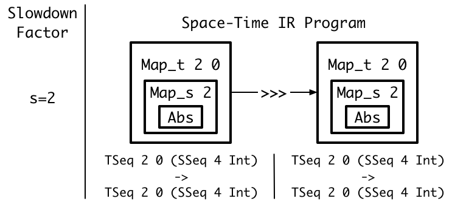
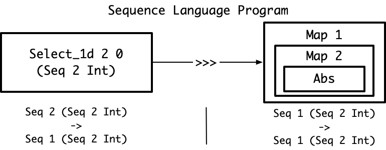
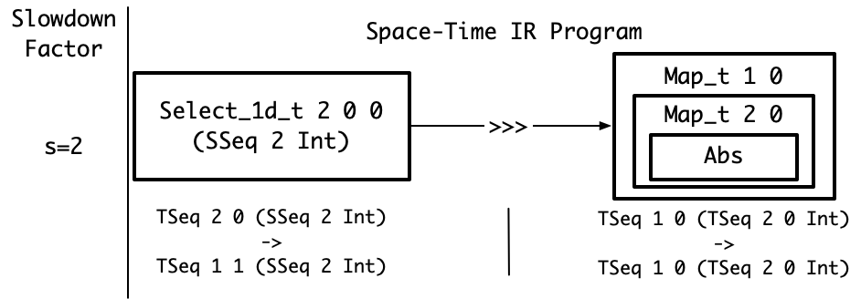

# Scheduling
The goal of this document is:
1. Define auto-scheduling and scheduling
1. List the motivating examples for the scheduling algorithm
1. Define the scheduling algorithm
   
# Auto-Scheduling and Scheduling Definitions
For a program `pseq` in the sequence language, the auto-scheduler searches for the highest throughput program in the space-time IR that fits within the target chip's constraints.

The below image is a visualization of the auto-scheduler. 
The blue line is the auto-scheduler's search space: the set of program's in the space-time IR that `Pseq` can be converted into. 
The red line is the maximum amount of area on the target chip.
The green line is the auto-scheduler's search process from the maximum throughput space-time IR program, `Pspace`, to the minimum area space-time IR program, `Ptime`.
The goal is the find the right-most point on the blue line that is below the red line.
The auto-scheduler accomplishes this goal by walking along the blue line in the direction indicated by the green line. 


The auto-scheduler's algorithm is:
1. Compile `pseq` to the program in the space-time IR with the greatest throughput. I will refer to this program as `pspace`
    1. This is determined by rewriting every operator in `pseq` to it's space version in the space-time IR.
    1. This program will process the entire input in one clock cycle during steady-state.
1. Compile `pseq` to the program in the space-time IR that is the greatest throughput of the minimum area programs. I will refer to this program as `ptime`.
    1. This is partially determined by rewriting every operator in `pseq` to it's time version in the space-time IR.
    1. There are an infinite number of least area programs because all operators can be arbitrarily underutilized with the same hardware resources.
        1. For example, `Map_t 2 0 Abs :: TSeq 2 0 Int -> TSeq 2 0` requires the same hardware and is three times higher throughput than `Map_t 2 4 Abs :: TSeq 2 4 Int -> TSeq 2 4`
        1. Adding more invalid clocks expresses the underutilized. In the above example, `Map_t 2 0` has 0 invalid clocks on its input and output. `Map_t 2 4` has 4 invalid clocks on its input and output.
    1. This program is the one with the minimum number of invalids.
1. Let `max_time = time(ptime))`. For each integer **s** from 1 to `max_time`, schedule `pseq` with slowdown factor **s**. 
This program `pspace_time` will have a throuhgput **s** times less than that of `pspace`. 
`pspace_time` will take **s** clock cycles to process an the input during steady-state. 
Stop at the first **s** that fits on the target chip.
    1. Scheduling with a slowdown factor is converting a program from the sequence language to one in the space-time IR that has an output throughput that is **s** times less than `pspace`.
    1. Note that throughput here is steady-state throughput. We are not considering delays.


The code for the auto-scheduler is:
```
autoscheduler :: Area -> Seq_Expr -> Space_Time_Expr
autoscheduler max_area pseq = 
    pspace = sequence_to_space_operators(pseq)

    # assume automatically solving ILP optimization problem
    ptime = sequence_to_time_operators(pseq)

    max_slowdown = floor(throughput(pspace) / throughput(ptime))
    for s in [1 .. max_slowdown]:
        pspace_time = schedule pseq pspace ptime s
        if area(pspace_time) <= max_area:
            return pspace_time
    
    fail "Unable to fit sequence program on target chip."
```

The following sections will work through the implementation of the scheduling algorithm. 

# Scheduling Problem Definition
An Aetherling program is a DAG.
The nodes `N` are the operators. A node from a higher-order operator, like a `Map`, may contain a sub-DAG.
The edges `E` are the producer-consumer relationships between nodes.
There is one output node `N_out`. This node is not composed with any consumers.
The output type of the program is equal to the output type of the `N_out`.

The goal of scheduling is: given a slowdown factor **s**, rewrite all of the nodes from the sequence language to the space-time IR so that:
    1. `N_out` has the desired throughput that is **s** times slower than its output throuhgput in `pspace`
    2. Minimize the compute and memory resources needed by the space-time IR nodes

# Naive Scheduler

The naive auto-scheduler is, for each operator, apply the slowdown factor if possible by applying the appropriate rewrite rules.
If not possible or slowing down the operator is insufficient to reach the desired throughput, recur on nested operators. 

The code for the naive scheduler is:
```
schedule :: Seq_Expr -> Space_Time_Expr -> Space_Time_Expr -> Int -> Space_Time_Expr
schedule pseq pspace ptime s =
    n_xs = get_all_nodes pseq
    map (\n -> rewrite_with_slowdown n pspace ptime s) n_xs
```

The [naive scheduler examples](#naive_scheduler_examples) show that this attempt fails to correctly schedule programs that compose multi-rate and nested operators. 


# Naive Scheduler Examples
The below examples show four issues that the scheduler will have to handle:
1. **Individual Operator Rewrites** - scheduling individual, sequence operators by rewriting them to space-time operators with the desired throughput
1. **Composition** - scheduling composed operators so that the produced space-time operators have matching type signatures 
1. **Multi-Rate** - scheduling operators that accept and emit different numbers of outputs, such as `Up_1d` and `Down_1d`
1. **Composition of Multi-Rate and Nesting Manipulation** - scheduling the composition of nested and multi-rate operators. This is the example that the naive scheduler cannot handle.

## Individual Operator Rewrites
This example shows the simplest pipeline that can be scheduled.
The sequence language program is:
```
Map 4 Abs
```

Slowdown factors **s** that the rewrite rules can produce are `1,2,4`.
These are the valid **s** as they are the factors of `4`.
The following diagrams shows the process of applying the naive scheduler with these different **s**.
The first diagram is the program in the sequence language AST.
Each box represents a node in the AST. 
A box inside another box indicates a parent-child relationship.
For example, `Map 4 Abs` on the left indicates that `Map 4` is the parent node of `Abs`. 
The text below the `Map 4 Abs` is the type signature of the AST node.


The second diagram is the program in the space-time IR AST after scheduling with `s=1`
The naive scheduler has applied the sequence\_to\_space rewrite rule to `Map 4 Abs` to produce `Map_s 4 Abs`.
The naive scheduler correctly handles this case:
1. The outputs of the programs are at the correct throughputs. 
The output type is `SSeq 4 Int`, four `Int`s in one clock. 
This is the highest possible throughput for four `Int`s.
1. The type signatures of all composed operators match. There are no composed operators.


The third diagram is the program in the space-time IR AST after scheduling with `s=2`
The naive scheduler has applied the sequence\_to\_nested\_time\_space rewrite rule to `Map 4 Abs` to produce `Map_t 2 0 (Map 2 Abs)`.
The naive scheduler correctly handles this case:
1. The outputs of the programs are at the correct throughputs. 
The output type is `TSeq 2 0 (SSeq 2 Int)`, four `Int` in two clocks.
This throughput is two times smaller than the throughput of the `s=1` program with output type `SSeq 4 Int`.
1. The type signatures of all composed operators match. There are no composed operators.


## Composition
This example demonstrates the issue of rewriting composed operators while preserving the fact that all producers and consumers have matching type signatures.
The sequence language program is:
```
Map 4 Abs >>> Map 4 Abs
```

Slowdown factors **s** that the rewrite rules can produce are `1,2,4`.
The following diagrams shows the process of applying the naive scheduler.
The first diagram is the program in the sequence language AST.
The arrow from one operator to the next with `>>>` indicates composition.
The left operator is the producer and the right operator is the consumer.


The second diagram is the program in the space-time IR AST after scheduling with `s=2`
The naive scheduler has independently applied the sequence\_to\_nested\_time\_space rewrite rule to both `Map 4 Abs` to produce `Map_t 2 0 (Map 2 Abs)`.
The naive scheduler correctly handles this case for the same reasons as the [individual operator rewrites example.](#individual-operator-rewrites)



## Multi-Rate
This example demonstrates the issue of rewriting operators with different input and output invalid clocks and thus throughputs.
The sequence language program is:
```
Select_1d 4 0 Int
```

Attainable s are `1, 2, 4`.
The following diagrams shows the process of applying the naive scheduler.
The first diagram is the program in the sequence language AST.
The type signature does not account for invalid clocks since the sequence language doesn't consider throughput.


The second diagram is the program in the space-time IR AST after scheduling with `s=2`
The naive scheduler has applied the sequence\_to\_nested\_time\_space rewrite rule to `Select_1d 4 Int`.
The naive scheduler correctly handles this case for the same reasons as the [individual operator rewrites example.](#individual-operator-rewrites)
Note in this diagram the `Map_t 1 1` has one invalid clock on its input and output types. This is necessary in order to match the type produced by `Select_1d_t 2 0 0`.
The throughputs for this program are four `Int` inputs per two clocks and one `Int` output per two clocks.


## Composition of Multi-Rate and Nesting
This example demonstrates the issue of scheduling multi-rate and nested operators while ensuring that their types compose after applying the rewrite rules.
The naive scheduler cannot handle this example
The sequence language program is:
```
Select_1d 2 0 (Seq 2 Int) >>> Map 1 (Map 2 Abs)
```

Attainable s are `1, 2, 4`.
The following diagrams shows the process of applying the naive scheduler.
The first diagram is the program in the sequence language AST.



The second diagram is the program in the space-time IR AST after scheduling with `s=2`
The naive scheduler has applied the sequence\_to\_time rewrite rule to `Select_1d 2 0 (Seq 2 Int)` while converting its `Seq 2 Int` to an `SSeq 2 Int`.
This produces a `Select_1d_t 2 0 0 (SSeq 2 Int)` with a throughput that is two times less than the throughput of the fully parallel `Select_1d_s 2 0 (SSeq 2 Int)`
The naive scheduler has applied the sequence\_to\_time rewrite rule to both `Map` in `Map 1 (Map 2 Abs)`, producing a `Map_t 1 0 (Map_t 2 0 Abs)`.
This operator has a throughput that is two times less than the throughput of the fully parallel `Map_s 1 (Map_s 2 Abs)`.
However, the operators' types don't match and the produced hardware cannot be composed.
The `Select_1d_t` has an output of two `Int` every other clock. 
The `Map_t 1 0 (Map_t 2 0 Abs)` has an input of an `Int` input every clock.
Thus, the naive scheduler has failed to produce valid hardware.



# Recursive Scheduler
The next attempt at a scheduling algorithm addresses the composition of multi-rate and nesting manipulation example by considering dependencies between composed operators.
It walks the expression tree from output to input.
During this walk, it schedules each operator so that the types of composed operators match.
The scheduling algorithm is:
```
schedule :: Seq_Expr -> Space_Time_Expr -> Space_Time_Expr -> Int -> Space_Time_Expr
schedule pseq pspace ptime s =
    n_out = get_output_node pseq
    n_out_st = rewrite_with_slowdown n_out pspace ptime s
    n_out_st_input_types = get_input_types n_out_st
    n_out_producers = get_producers n_out
    set_producers n_out_st 
        [schedule_op n_out_producers[i] n_out_st_input_types[i] | i <- 0..len(n_out_producers)]
    return n_out_st

schedule_op :: Seq_Expr -> Space_Time_Type -> Space_Time_Expr
schedule_op n consumer_type =
    n_st = rewrite_with_output_type n consumer_type
    n_st_input_types = get_input_types n_st
    n_producers = get_producers n
    set_producers n_st 
        [schedule_op n_producers[i] n_st_input_types[i] | i <- 0..len(n_producers)]
    return n_st
```

This algorithm has two main limitations.
First, it cannot handle DAGs. 
It treats expressions as trees and so ignores dependencies between nodes that appear multiple times in a DAG.
The [recursive scheduler examples](#recursive-scheduler-examples) will demonstrate this issue.
Second, it only evaluates one of multiple possible schedules for a given **s** and `pseq`.
For example, there are multiple possible ways to rewrite an operator to match a slowdown.
`rewrite_with_slowdown` arbitrarily picks one.
The recursive, DAG-aware scheduler will address both of these issues.

# Recursive Scheduler Examples

## Composition of Multi-Rate and Nesting Manipulation
This example demonstrates the issue of scheduling both types of operators while ensuring that their types compose after applying the rewrite rules.
Unlike the naive scheduler, the recursive scheduler can handle this example.
The sequence program is:
```
Select_1d 2 0 (Seq 2 Int) >>> Map 1 (Map 2 Abs)
```

The result from scheduling for `s=2` with the recursive algorithm is:


The recursive scheduler first applies `rewrite_with_slowdown` to `Map 1 (Map 2 Abs)`, the output node of the program.
This will try to slowdown the node without introducing invalids, so it produces `Map_s 1 (Map_t 2 0 Abs)`.
`rewrite_with_slowdown` knows that slowing down the outer `Map 1` would require introducing invalids because `ptime` shows that the result of performing this slowdown is `Map_t 1 1`.
Then, the algorithm applies `rewrite_with_output_type` to `Select_1d 2 0 (Seq 2 Int)` with output type `SSeq 1 (TSeq 2 0 Int)`.
The result is `Select_1d_s 2 0 (TSeq 2 0 Int)`.
The `Select_1d_s` has an output of an `Int` every clock.
The `Map_s` has an input of an `Int` every clock.
Thus, the recursive scheduler has produced valid hardware where the naive one failed.

## Diamond
This example demonstrates the issue of scheduling a DAG with a diamond pattern: the input is used on two separate branches which are later merged.
The recursive scheduler cannot handle this example.
The sequence language program is:
```
diamond input =
    let prefix = Map 1 (Map 1 Abs) input
    let branch1 = (Up_1d 2 (Seq 1 Int) >>> Unpartition 2 1 Int) prefix
    let branch2 = (Map 1 (Up_1d 2 Int) >>> Unpartition 1 2 Int) prefix
    Map2 2 Tuple branch1 branch2
```

Attainable s are `1, 2, 4`.
The following diagrams shows the process of applying the naive scheduler.
The first diagram is the program in the sequence language AST.


The second diagram is the program in the space-time IR AST after scheduling with `s=2`
The recursive scheduler has scheduled each branch independently. 
For each branch, `rewrite_with_output_type` slows the `Up_1d` because that minimizes underutilization. 
As a result, `branch1` wants to rewrite `prefix` to `Map_t 1 1 (Map_s 1 Abs)` while `branch2` wants to rewrite prefix to `Map_s 1 (Map_t 1 1 Abs)`.
This is invalid hardware as `prefix` can only be one implementation.


# Recursive, Memoized Scheduler
The next scheduling algorithm addresses the diamond type mismatch issue.
It performs the same walk of the expression tree as the above, recursive scheduling algorithm.
However, it memoizes the calls to `schedule_op`.
Therefore, if a node is scheduled once in one part of the expression tree, it will not be scheduled different in a different part of the expression tree.
As a result, `schdule_op` will need to handle the case where a recursive call to `schedule_op` does not return a producer with the expected type.
In this case, `Reshape`s are added where necessary to fix types.
The scheduling algorithm is:
```
schedule :: Seq_Expr -> Space_Time_Expr -> Space_Time_Expr -> Int -> Space_Time_Expr
schedule pseq pspace ptime s =
    n_out = get_output_node pseq
    n_out_seq_type = get_output_type pseq
    n_out_st_type = rewrite_type_with_slowdown output_seq_type s
    n_out_st = rewrite_with_output_type n_out n_out_st_type 
    n_out_st_input_types = get_input_types n_out_st
    n_out_producers = get_producers n_out
    n_out_st_producers_maybe_wrong_type = 
        [memo schedule_op n_out_producers[i] n_out_st_input_types[i] | i <- 0..len(n_out_producers)]
    n_out_st_producers = map2 (add_reshape_to_match) n_out_st_producers_maybe_wrong_type n_out_st_input_types
    map2 set_producers n_out_st n_out_st_input_types
    return n_out_st

schedule_op :: Seq_Expr -> Space_Time_Type -> Space_Time_Expr
schedule_op n consumer_type =
    n_st = rewrite_with_output_type n consumer_type
    n_st_input_types = get_input_types n_st
    n_producers = get_producers n
    n_st_producers_maybe_wrong_type = 
        [memo schedule_op n_out_producers[i] n_out_st_input_types[i] | i <- 0..len(n_out_producers)]
    n_st_producers = map2 (add_reshape_to_match) n_out_st_producers_maybe_wrong_type n_out_st_input_types
    map2 set_producers n_st n_st_input_types
    return n_st
```

An imperative version of the scheduling algorithm is:

```
Input:
    pseq - the sequence language program. A program is an expression tree
    s - the slowdown factor. This is the number of clock cycles for the output type.

Output:
    psched - the scheduled program in the space-time IR

Algorithm:
    // Rewrites From Sequence Language To Space-Time IR:
    function rewrite_op(cur_seq_node, produced_st_type, memo_map)
        if cur_seq_node in memo_map:
            return memo_map[cur_seq_node]

        cur_st_node = rewrite_with_output_type cur_seq_node produced_st_type
        consumed_st_types = get_input_types cur_st_nodes
        producers_seq = get_producers cur_seq_node
        producers_st = List()

        for i in range(len(producers_seq)):
            producer_st = rewrite_op(producers_seq[i], consumed_st_types[i], memo_map)
            producer_type = get_output_type producer_st
            if producer_type != consumed_st_types[i]:
                producers_st.append(add_reshape(producer_st, consumed_st_types[i]))
            else:
                producers_st.append(producer_st)
                
        set_producers(cur_st_node, producers_st)
        memo_map.add(cur_seq_node, cur_st_node)
        return cur_st_node
    
    output_seq_type = get_output_type pseq
    output_st_type = rewrite_type_with_slowdown output_seq_type s
    memo_rewrites = Map()
    psched_mismatched_latencies = rewrite_op(pseq, output_st_type, memo_rewrites)
    memo_latencies = Map()
    (psched, _) = match_latencies(psched_mismatched_latencies, memo_latencies)
    return psched
```

# Recursive, Memoized Scheduler Example
## Diamond
This example demonstrates the issue of scheduling a DAG with a diamond pattern: the input is used on two separate branches which are later merged.
Unlike the recursive scheduler, the recursive, memoized scheduler can successfully match types in this example.

The sequence language program is:
```
diamond input =
    let prefix = Map 1 (Map 1 Abs) input
    let branch1 = (Up_1d 2 (Seq 1 Int) >>> Unpartition 2 1 Int) prefix
    let branch2 = (Map 1 (Up_1d 2 Int) >>> Unpartition 1 2 Int) prefix
    Map2 2 Tuple branch1 branch2
```

The result from scheduling for `s=2` with the recursive, memoized, branching algorithm is:


The algorithm schedules `branch1` first. 
Therefore, it schedules `prefix` to match `branch1`'s nesting structure.
When the algorithm schedules `branch2`, the memoization returns the prior scheduling of `prefix` to match `branch1`.
The scheduler adds a `Reshape` to address the mismatch between the output type of `prefix` and the input type of `branch2`, 

While the types match, the produced hardware will not match the semantics of the sequence language program.
The top branch has less latency than the bottom branch. 
Therefore, the tuple in hardware will combine different elements than the tuple in the sequence language.

# Recursive, Memoized Scheduler With Latency Matching
The next scheduling algorithm addresses the diamond latency issue.
It performs the same walk of the expression tree as the above, recursive, memoized scheduling algorithm.
However, it has a second pass that inserts FIFOs when there are mismatched latencies.
The FIFOs will match the latencies. 
The scheduling algorithm is below. Note: no functional version is provided because the list comprehensions become unreadable.

```
Input:
    pseq - the sequence language program. A program is an expression tree
    s - the slowdown factor. This is the number of clock cycles for the output type.

Output:
    psched - the scheduled program in the space-time IR 

Algorithm:
    // Rewrites From Sequence Language To Space-Time IR:
    function rewrite_op(cur_seq_node, produced_st_type, memo_map)
        if cur_seq_node in memo_map:
            return memo_map[cur_seq_node]

        cur_st_node = rewrite_with_output_type cur_seq_node produced_st_type
        consumed_st_types = get_input_types cur_st_nodes
        producers_seq = get_producers cur_seq_node
        producers_st = List()

        for i in range(len(producers_seq)):
            producer_st = rewrite_op(producers_seq[i], consumed_st_types[i], memo_map)
            producer_type = get_output_type producer_st
            if producer_type != consumed_st_types[i]:
                producers_st.append(add_reshape(producer_st, consumed_st_types[i]))
            else:
                producers_st.append(producer_st)
                
        set_producers(cur_st_node, producers_st)
        memo_map.add(cur_seq_node, cur_st_node)
        return cur_st_node
    

    // Insertion of FIFOs to Match Latencies
    function match_latencies(cur_st_node, memo_map)
        if cur_seq_node in memo_map:
            return memo_map[cur_seq_node]

        producers_seq = get_producers cur_st_node
        consumed_st_types = get_input_types cur_st_nodes
        producers_seq = get_producers cur_seq_node
        producers_st = List()

        // only two cases since all ops in Aetherling have at most 2 inputs 
        // and only binary operators can have two inputs with different latencies
        if len(producers_seq) == 0:
            cur_latency = get_latency(cur_st_node)
        else if len(producers_seq) == 1:
            (matched_producer_st, producer_latency) = 
            cur_latency = producer_latency + get_latency(cur_st_node)
        else if len(producers_seq) == 2:
            (matched_left_producer_st, left_latency) = match_latencies(producers_st[0], memo_map)
            (matched_right_producer_st, right_latency) = match_latencies(producers_st[1], memo_map)
            cur_latency = max(producer_left_latency, producer_right_latency) + get_latency(cur_st_node)
            if left_latency == right_latency:
                producers_st.append(matched_left_producer_st)
                producers_st.append(matched_right_producer_st)
            else if left_latency > right_latency:
                producers_st.append(matched_left_producer_st)
                producers_st.append(add_fifo(matched_right_producer_st, left_latency - right_latency))
            else:
                producers_st.append(add_fifo(matched_left_producer_st, right_latency - left_latency))
                producers_st.append(matched_right_producer_st)

        memo_map.add(cur_seq_node, cur_st_node)
        return (cur_st_node, cur_latency)

    
    output_seq_type = get_output_type pseq
    output_st_type = rewrite_type_with_slowdown output_seq_type s
    memo_rewrites = Map()
    psched_mismatched_latencies = rewrite_op(pseq, output_st_type, memo_rewrites)
    memo_latencies = Map()
    (psched, _) = match_latencies(psched_mismatched_latencies, memo_latencies)
    return psched
```

# Recursive, Memoized Scheduler With Latency Matching Example
## Diamond
This example demonstrates the issue of scheduling a DAG with a diamond pattern: the input is used on two separate branches which are later merged.
Unlike the recursive scheduler, the recursive, memoized scheduler can successfully match types in this example.

The sequence language program is:
```
diamond input =
    let prefix = Map 1 (Map 1 Abs) input
    let branch1 = (Up_1d 2 (Seq 1 Int) >>> Unpartition 2 1 Int) prefix
    let branch2 = (Map 1 (Up_1d 2 Int) >>> Unpartition 1 2 Int) prefix
    Map2 2 Tuple branch1 branch2
```

The result from scheduling for `s=2` with the recursive, memoized, branching algorithm is:


This is the same as the output of the prior algorithm except that a FIFO has been added to match latencies.
The extra reshape at the start of the lower branch adds 1 cycle of extra latency to that branch.

# Recursive, Memoized, Branching Scheduler
The final scheduling algorithm addresses the diamond issue while also exploring multiple schedules.
It performs the same walk of the expression tree as the above, recursive scheduling algorithm.
However, it memoizes the calls to `schedule_op`.
Therefore, if a node is scheduled once in one part of the expression tree, it will not be scheduled different in a different part of the expression tree.
As a result, `schdule_op` will need to handle the case where a recursive call to `schedule_op` does not return a producer with the expected type.
In this case, `Reshape`s are added where necessary to fix types.
`Reshape`s are also used to explore multiple possible schedules.
For each stage in the expression tree, rather than rewriting an operator to match the consumer's type, the operator may produce any other type of the same throuhgput and apply a `Reshape` to convert between the two.
The `schedule_op` explores all such schedules by returning a list of Space_Time_Expr.
Each element in the list is a different `Reshape`.
The scheduling algorithm is:
```
schedule :: Seq_Expr -> Space_Time_Expr -> Space_Time_Expr -> Int -> Space_Time_Expr
schedule pseq pspace ptime s =
    n_out = get_output_node pseq
    n_out_seq_type = get_output_type pseq
    n_out_st_type_xs = rewrite_type_with_slowdown output_seq_type s
    n_out_st_xs = map (rewrite_with_output_type n_out) n_out_st_type_xs
    n_out_st_input_type_xss = map get_input_types n_out_st_xs
    n_out_producer_xs = get_producers n_out
    n_out_st_producer_xss_maybe_wrong_type =
        [[memo schedule_op n_out_producer_xs[j] n_out_st_input_types_xss[i][j] | j <- 0..len(n_out_producers)] 
           | i <- 0..len(n_out_st_xs) ]
    n_out_st_producers_xss = map2 (map2 (add_reshape_to_match)) n_out_st_producers_xss_maybe_wrong_type n_out_st_input_type_xss
    map2 set_producers n_out_st_xs n_out_st_input_type_xss
    return n_out_st_xs

schedule_op :: Seq_Expr -> Space_Time_Type -> [Space_Time_Expr]
schedule_op n consumer_type =
    (reshapes, producer_types) = generate_all_possible_reshapes consumer_type
    n_st_xs = map2 rewrite_with_output_type reshapes producer_types
    n_st_input_type_xss = map get_input_types n_st_xs
    n_producer_xs = get_producers n
    n_st_producer_xss_maybe_wrong_type =
        [[memo schedule_op n_producer_xs[j] n_st_input_types_xss[i][j] | j <- 0..len(n_producers)] 
           | i <- 0..len(n_st_xs) ]
    n_st_producers_xss = map2 (map2 (add_reshape_to_match)) n_st_producers_xss_maybe_wrong_type n_st_input_type_xss
    map2 set_producers n_st_xs n_st_input_type_xss
    return n_st_xs
```

# Rewriting An Operation For An Output Type
There are three ways to lower an operator from the sequence language to the space-time IR:
1. Fully Sequential - the operator is rewritten using the sequence-to-time rewrite rules that it's input and output types are `TSeq`.
1. Fully Parallel - the operator is rewritten using the sequence-to-space rewrite rules that it's input and output types are `SSeq`
1. Partially Parallel - the operator is rewritten using the nesting, sequence-to-time, and sequence-to-space rewrite rules so that it's input and output types are `TSeq (SSeq)`

These options are defined for each operator in [the basic document's rewrite section](Basic.md#rewrites).
The implementation of `rewrite_with_output_type` must be able to handle all three of those cases:

```
rewrite_with_output_type :: Seq_Expr -> Space_Time_Type -> Space_Time_Expr
rewrite_with_output_type n out_st_type =
    hd_out_st_type : tl_out_st_type = out_st_type
    if (is_sseq hd_out_st_type):
        n_st = sequence_to_space n hd_out_st_type
    if (is_tseq hd_out_st_type):
        n_st = sequence_to_time n hd_out_st_type
    if (is_tseq_sseq hd_out_st_type):
        n_st = nest_then_to_space_time n hd_out_st_type
    
    -- schedule the sub-DAGs of higher order operators such as Map and Reduce
    if (is_higher_order n):
       subgraph = get_output_node (get_dag n)
       subgraph_st = schedule_op subgraph tl_out_st_type
       set_subgraph n_st subgraph_st
    -- otherwise, if operator is parameterized by a type, rewrite that type
    -- must be custom for each operator as the output type doesn't always equal
    -- the input type
    else if (is_parameterized_by_type n):
       type_param = get_type_param n
       type_param_st = rewrite_type type_param tl_out_st_type
       set_type_param n_st type_param_st

    return n_st
```


# Rewriting A Type For A Slowdown
There are many options for rewriting a type with a slowdown. 
This section describes both an algorithm the finds one, reasonable choice and an algorithm that finds all options.

## One Option
A reasonable option for picking a type is to try nest `SSeq`s as much as possible. 
This will produced non-strided reads and writes. 
This means producing a type like `TSeq (TSeq (SSeq (SSeq)))` where the `SSeq` are nested
A type such as `SSeq (TSeq)` produces strided accesses. 
Strided accesses should be avoided as they require more complex memory access patterns.


The below type rewriting algorithm produces attempts to nest the `SSeq` as deeply as possible.

```
Input:
    seq_type - the sequence language type
    s - the slowdown factor. This is the number of clock cycles for the space-time type

Output:
    st_type - the type in the space-time IR

Algorithm:
    // These indicate whether to convert a Seq to space, time, split time-space
    // or nothing if an atom and not a seq
    data Type_Rewrite = 
        SpaceR (n: Int) (inner_type_rewrite: Type_Rewrite)
        | TimeR (n: Int) (i: Int) (inner_type_rewrite: Type_Rewrite)
        | TimeSpaceR (no: Int) (io: Int) (ni: Int) (inner_type_rewrite: Type_Rewrite)
        | AtomR
    
    function get_all_spacer(seq_type)
       if is_atom(seq_type):
           return AtomR
       else: 
           inner_type_rewrite = get_all_spacer(seq_type.inner_type)
           return SpaceR seq_type.n inner_type_rewrite

    function rewrite_type_no_underutil(cur_type_rewrite, s_factor)
        if cur_type_rewrite is SpaceR:
            n = cur_type_rewrite.n
        else if cur_type_rewrite is TimeR:
            (cur_type_rewrite.inner_type_rewrite, used_s) = rewrite_type_no_underutil(cur_type_rewrite.inner_type_rewrite, s_factor)
            return (cur_type_rewrite, used_s)
        else if cur_type_rewrite is TimeSpaceR:
            n = cur_type_rewrite.no * cur_type_rewrite.ni
        else if cur_type_rewrite is AtomR:
            return (AtomR, False)
           
        if (n == s_factor):
            return (TimeR n 0 cur_type_rewrite.inner_type_rewrite, True)
        else if (n % s_factor == 0):
            no = s_factor
            ni = get_n(cur_seq_type) // no
            return (TimeSpaceR no 0 ni cur_type_rewrite.inner_type_rewrite, True)
        else:
            (cur_type_rewrite.inner_type_rewrite, used_s) = rewrite_type_no_underutil(cur_type_rewrite.inner_type_rewrite, s_factor)
            return (cur_type_rewrite, used_s)

    function rewrite_type_with_underutil(cur_type_rewrite, s_factor)
        if cur_type_rewrite is SpaceR:
            n = cur_type_rewrite.n
        else if cur_type_rewrite is TimeR:
            (cur_type_rewrite.inner_type_rewrite, used_s) = rewrite_type_with_underutil(cur_type_rewrite.inner_type_rewrite, s_factor)
            return (cur_type_rewrite, used_s)
        else if cur_type_rewrite is TimeSpaceR:
            n = cur_type_rewrite.no * cur_type_rewrite.ni
        else if cur_type_rewrite is AtomR:
            return (AtomR, False)
        
        valid_check_result = is_valid_tseqsseq(s, n)
        if valid_check_result.is_valid
            return (TimeSpaceR valid_check_result.no valid_check_result.io valid_check_result.ni cur_type_rewrite.inner_type_rewrite, True)
        else 
            (cur_type_rewrite.inner_type_rewrite, used_s) = rewrite_type_with_underutil(cur_type_rewrite.inner_type_rewrite, s_factor)
            return (cur_type_rewrite, used_s)
    
    cur_type_rewrite = get_all_spacer(seq_type)
    s_factors = factorize s
    unused_s = List[] 
    for s_factor in s_factors:
        (cur_type_rewrite, used_cur_s) = rewrite_type_no_underutil(cur_type_rewrite, s_factor)
        if not used_cur_s:
            unused_s.append(s_factor)
    for s_factor in unused_s:
        (cur_type_rewrite, used_cur_s) = rewrite_type_no_underutil(cur_type_rewrite, s_factor)
        if not used_cur_s:
            throw Exception("Cannot slow type by s")
    return convert_type_rewrites_to_types(cur_type_rewrite)
    
```

### Valid Slowdowns For a Layer and `is_valid_tseqsseq`
There are four ways ways to apply a prime slowdown `s_p` to `SSeq n` with `i_max`. 
The first three are handled by `rewrite_type_no_underutil`.
The fourth is handled by `rewrite_type_with_underutil`. 
The fourth point describes how to implement of `is_valid_tsseqsseq`
1. If `1 == s_p`, then `SSeq n`
1. If `(n+i_max) == s_p`, then `TSeq n i_max`
1. If `n % s_p == 0`, then `TSeq s_p 0 (SSeq (n / s_p))`
1. If `(n+i_max) >= s_p == 0`, then need to slowdown so that takes `s_p` clocks. 
There are multiple possible choices for the resulting `TSeq no io (SSeq ni)`. 
To find the best answer (least underutilization so smallest `io`):
    1. A solution must satisfy the following constraints:
        1. `no * ni == n`
        1. `no + io == s_p`
        1. `io <= i_max`
        1. `io >= 0`
        1. `no >= 0`
        1. `ni >= 0`
    1. min `io` as want minimum underutilization
    1. Algorithm - try all possible `ni` (all divisors of `n`) until you find one that satisfies all constraints

## All Options
This version of `rewrite_with_slowdown` provides all possible rewrites of a type for a slowdown.

```
rewrite_with_output_type :: Seq_Type -> Int -> Space_Time_Type
rewrite_with_output_type n pspace ptime s =
    s_factors = factorize s
    
    -- all possible distributions of all factors of slowdown amongst the layers of n_out_type
    type_factor_combinations_xs = get_all_distributions_of_factors n_out_type s_factors

    -- only allow valid slowdowns
    n_out_st_types_xs = rewrite_type_for_valid_slowdowns n_out_type type_factor_ccombinations_xs ptime

    return n_out_st_types_xs
```

# Underutilization Causes Scheduler To Produce Inefficient Hardware
The [recursive, memoized scheduler](#recursive-memoized-scheduler-with-latency-matching) can produce suboptimal hardware for common schedules that have underutilization.
Scheduling the sequence language program will demonstrate this issue:


The schduler should be able to produce a space-time IR program that emits pixel out every clock. 
Since the output is 12 ints and the input is 6 ints, such as schedule must have 6 invalid inputs.
The below space-time IR is an efficient schedule.
The hardware is efficient because the `Reshape` only requires a buffer of 1 Int.


The scheduler actually produces the below schedule.
The hardware is efficient because the `Reshape` must buffer data on order of the size of the whole image.


The scheduler produces this hardware because:
1. `seq` must be converted to either `tseq`, `sseq`, or `tseq (sseq)`
2. The input to the the types can only be rewt
