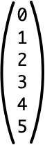
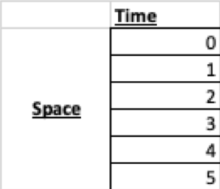
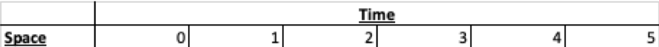
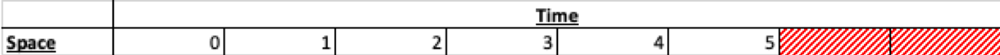

# Sequence and Space-Time Types
The goal of this document is to give an visual intuition for the semantics of Aetherling's type systems.
It shows examples of values in the sequence language, their types, isomorphic values in the space-time IR, and those values' types.

# Flat Sequences
The simplest example of a sequence value in the sequence language is below.
It is a sequence of four integers. 
Following Haskell syntax, we provide the type after `::`.
```
[0, 1, 2, 3, 4, 5] :: Seq 6 Int
```

By the [sequence-to-space-time-isomorphisms](Basic.md#sequence-isomorphisms), the prior sequence can be converted to an `SSeq` or a `TSeq`.

## Flat SSeq
The above `Seq` can be converted to an `SSeq` with six integers on one clock cycle.
The textual representation of the `SSeq` is:
```
[0, 1, 2, 3, 4, 5] :: SSeq 6 Int
```

The below diagrams show how the distribution of this value's elements in space and time.
The first diagram visualizes the structure of Aetherling's nested `SSeq`s and `TSeq`s.
The `()` indicate an `SSeq`.
This flat `SSeq` represents six elements on one clock cycle.


The second diagram shows the hardware perspective: what elements of the sequence will be materialized on which clock cycles. 
It does this by flattening the `SSeq`s and `TSeq`s.
The `SSeq 6 Int` materializes all six elements on the first clock cycle.

Note that, until the nested `Seq` example below, there is no flattening to demonstrate with this diagram.

## Flat TSeq With No Invalids
The above `Seq` can be converted to an `TSeq` with six integers on six clock cycle.
The textual representation of the `TSeq` is:
```
[0, 1, 2, 3, 4, 5] :: TSeq 6 0 Int
```

Just as with the `SSeq 6 Int` example, there are two diagrams.

The first diagram shows the nested structure of the Aetherling type.
Each box indicates one period of the `TSeq`.
This diagram has six boxes, each with one integer.
If a box contains only atoms and `SSeq`s, then the period for that box is one clock cycle.
Otherwise, the period of the box is computed based on the periods of the elements inside the box.
Therefore, it indicates one integer per clock for six clocks.


The second diagram shows the flattened, hardware perspective.
It also shows one integer per clock for six clocks.


## Flat TSeq With Invalids
The above `Seq` can be converted to an `TSeq` with six integers on eight clock cycles.
The textual representation of the `TSeq` is:
```
[0, 1, 2, 3, 4, 5] :: TSeq 6 2 Int
```

Just as with the `SSeq 6 Int` example, there are two diagrams.

The first diagram shows the nested structure of the Aetherling type.
This diagram has eight boxes.
The shaded ones indicate invalid periods with no data.
Therefore, it indicates one integer per clock for six clocks and then two invalid clocks.


The second diagram shows the flattened, hardware perspective.
It also shows one integer per clock for six clocks and then two invalid clocks.
The shaded regions indicate no data.



# Nested Sequence
By the [sequence language isomorphisms](Basic.md#sequence-isomorphisms), the above `Seq 6 Int` sequence can be converted into:
```
[[0, 1, 2], [3, 4, 5]] :: Seq 2 (Seq 3 Int)
```

The isomorphism preserves the order of the elements.
Flattening the nested sequence will produce a `Seq 6 Int` with integers in the same order as the initial `Seq 6 Int`.

## Nested SSeq
The above `Seq 2 (Seq 3 Int)` can be converted into a nested set of `SSeq`s with six integers on one clock cycle.
```
[[0, 1, 2], [3, 4, 5]] :: SSeq 2 (SSeq 3 Int)
```

The nested, Aetherling structure diagram shows an outer `SSeq 2`.
Each element of the `SSeq 2` is an `SSeq 3 Int`.
The six integers in total are all on one clock cycle.
")

The flattened, hardware diagram is the same as the one for the `SSeq 6 Int`.
All six integers are on one clock cycle.
 Table")

## Nested TSeq 
The above `Seq` can be converted to an `TSeq` with six integers on six clock cycle.
```
[0, 1, 2, 3, 4, 5] :: TSeq 6 0 Int
```
ith No Invalids


